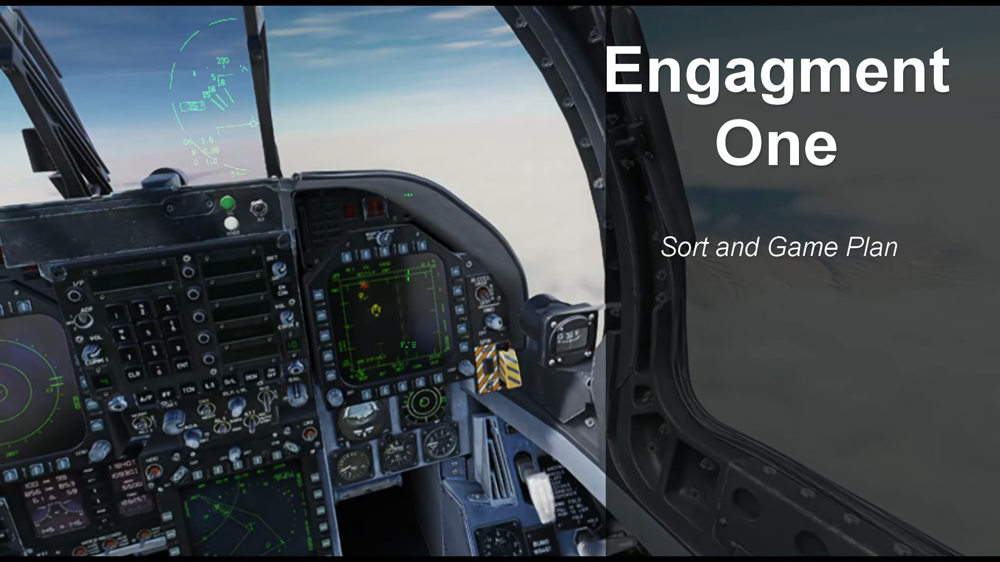

# SkyEye: AI Powered GCI Bot for DCS

SkyEye is a [Ground Controlled Intercept](https://en.wikipedia.org/wiki/Ground-controlled_interception) (GCI) bot for the flight simulator [Digital Combat Simulator](https://www.digitalcombatsimulator.com) (DCS). It is an advanced replacement for the in-game E-2, E-3 and A-50 AI aircraft.

SkyEye is a substantial improvement over the DCS AWACS:

1. SkyEye offers modern voice recognition using a current-generation AI model. Keyboard input is also supported.
2. SkyEye has natural sounding voices, instead of robotically clipping together samples. On Windows and Linux, SkyEye uses a neural network to speak in a human-like voice. On macOS, SkyEye speaks using a version of Siri's voice.
3. SkyEye adheres more closely to real-world [brevity](https://rdl.train.army.mil/catalog-ws/view/100.ATSC/5773E259-8F90-4694-97AD-81EFE6B73E63-1414757496033/atp1-02x1.pdf) and [procedures](https://www.alssa.mil/Portals/9/Documents/mttps/sd_acc_2024.pdf?ver=IZRWZy_DhRSOJWgNSAbMWA%3D%3D) instead of the incorrect brevity used by the in-game AWACS.
4. SkyEye supports a larger number of commands, including [PICTURE](docs/PLAYER.md#picture), [BOGEY DOPE](docs/PLAYER.md#bogey-dope), [DECLARE](docs/PLAYER.md#declare), [SNAPLOCK](docs/PLAYER.md#snaplock), [SPIKED](docs/PLAYER.md#spiked) , and [ALPHA CHECK](docs/PLAYER.md#alpha-check).
5. SkyEye intelligently monitors the battlespace, providing automatic [THREAT](docs/PLAYER.md#threat), [MERGED](docs/PLAYER.md#merged) and [FADED](docs/PLAYER.md#faded) callouts to improve situational awareness.

SkyEye uses Speech-To-Text and Text-To-Speech technology which can run locally on the same computer as SkyEye. No cloud APIs are required, although cloud APIs are optionally supported. It works with any DCS mission, singleplayer or multiplayer. No special scripting or mission editor setup is required. You can run it for less than a nickel per hour on a cloud server, or run it on a computer in your home running Windows, Linux or macOS.

SkyEye is production ready software. It is used by a few public servers and many private squadrons. Based on download statistics, I estimate over 100 communities are using SkyEye, such as:

- [Flashpoint Levant](https://limakilo.net/)
- [Victor Romeo Sierra](https://forum.dcs.world/topic/368175-launching-ai-centric-dcs-server-victor-romeo-sierra/)
- [DCS ANZUS](https://www.dcsanzus.com/)

SkyEye is **free software**. It is free as in beer; you can download and run it for free. It is also free as in freedom; the source code is available for you to study and modify to fit your needs.

## Getting Started

* Players: See [the user guide](docs/PLAYER.md) for instructions on using the bot.
* Server admins: See [the admin guide](docs/ADMIN.md) for a technical guide on deploying the bot.
* Developers: See [the contributing guide](docs/CONTRIBUTING.md) for instructions on building, running and modifying the bot.
* Please also see [the privacy statement](docs/PRIVACY.md) to understand how SkyEye uses your voice and gameplay data to function.

## Demonstration

See it in action! Jump to 7:24 in [this demo video by DCS ANZUS](https://youtu.be/yksS1PBH2x0?t=444)

## FAQ

### What kind of hardware does it require?

See the [Hardware section of the admin guide](docs/ADMIN.md#hardware).

### Can I train the speech recognition on my voice/accent?

Since the software runs 100% locally, the speech recognition model is a local file. Server operators can provide a trained model as an alternative to the off-the-shelf model. See [this blog post](https://huggingface.co/blog/fine-tune-whisper) for an example.

I don't plan to provide a mechanism for players to submit their voice recordings to the main repository due to data privacy concerns.

### Does this use Line-Of-Sight restrictions?

Not at this time. I am working on a solution for this, but it will take me a while.

If this is a critical feature for you, consider using [MOOSE's AWACS module](https://flightcontrol-master.github.io/MOOSE_DOCS_DEVELOP/Documentation/Ops.AWACS.html) instead. It supports Line-Of-Sight and datalink simulation, at the tradeoff of requiring some special setup in the Mission Editor.

OverlordBot also optionally supports this feature, although less than 1% of users used it.

### Will this work with DCS' built-in VoIP?

As of this writing, DCS' built-in VoIP does not support external clients. SkyEye therefore requires SRS to function.

### Could this use a Large Language Model? (llama, mistral, etc.)

SkyEye uses an embedded LLM for speech-to-text, but I deliberately chose not to use an LLM for SkyEye's language parsing or decision-making logic.

Within the domain of air combat communication, these problems are less linguistic and more mathematical in nature. Air combat communication uses a limited, highly specific vocabulary and a low-context grammar that can be parsed quickly with traditional programming methods. The workflow for the tactical controller is a straightforward decision tree mostly based on tables of aircraft data, some middle school geometry and a few statistical methods. These workflows can be implemented in a few hundred lines of code and run in a few milliseconds. An LLM would have worse performance, no guarantee of consistency, much larger CPU and memory requirements, and introduces a large surface area of ML-specific issues such as privacy of training data sets, debugging hallucinations, and a much more difficult testing and validation process.

While working on this software I spoke to a number of people who thought it would be as easy as feeding a bunch of PDFs to an LLM and it would magically learn how to be a competent tactical controller. This could not be further from the truth!

### Could this provide ATC services?

I have no plans to attempt an ATC bot due to limitations within DCS.

AI aircraft in DCS cannot be directly commanded through scripting or external software and are incapable of safely operating in controlled airspace. for example, AI aircraft in DCS do not sequence for landing, and will only begin an approach if the entire approach and runway are clear. AI aircraft also cannot execute a hold or a missed approach, and they make no effort to maintain separation from other aircraft.

While working on this software I spoke to a number of people who thought it would be as easy as feeding a bunch of PDFs to an LLM and it would magically become a capable Air Traffic Controller. This could not be further from the truth! [See this post by a startup working on AI for ATC on the challenges involved.](https://news.ycombinator.com/item?id=43257323)

### Are there options for different voices?

SkyEye can be used with one of three voices:

1. Jenny, a feminine Irish English voice available on Windows and Linux.
2. Alan, a masculine British English voice available on Windows and Linux.
3. Samantha, a feminine US English voice available on macOS. This is the version of Siri's voice from the iPhone 4s, iPhone 5 and iPhone 6.

I have chosen these voices because they meet the following criteria:

- Permissive licensing
- Source data was recorded with consent
- Correct and unambiguous pronunciation, especially of numeric values, NATO reporting names and the Core Information Format
- Able to run fully offline on modest hardware in near-realtime
- Easily redistributable without requiring complex additional software to be installed
- Sound the same regardless of the make and model of CPU or GPU used to generate it
- Likely to remain functional many years into the future, including on future OS versions

I have investigated a number of alternative AI voices including ElevenLabs, OpenAI, Kokoro, Sherpa, Coqui, and others. I have not found voices that better meet these criteria. I continue to follow the state of the art and watch for new developments.

### Can you add an option to do _insert feature here_?

I'm happy to hear your ideas, but I am very selective about what I choose to implement.

I develop SkyEye at no monetary cost to the user; therefore, one of my priorities is to keep the complexity of the software close to the minimum necessary level to ease the maintenance burden. I'm focusing only on features that are useful to most players. I avoid adding features that are gated by configuration options, because each one multiplies the permutations that need to be tested and debugged. [See this video.](https://youtu.be/czzAVuVz7u4?t=995)

SkyEye is open source software. If you want a feature that I don't want to maintain, you have the right to fork the project and add it yourself (or hire a programmer to add it for you).

## Technology

SkyEye would not be possible without these people and projects, for whom I am deeply appreciative:

* [DCS-SRS](https://github.com/ciribob/DCS-SimpleRadioStandalone) by @ciribob. Ciribob also patiently answered many of my questions on SRS internals and provided helpful debugging tips whenever I ran into a block in the SRS integration.
* [Tacview](https://www.tacview.net/) - specifically, [ACMI real time telemetry](https://www.tacview.net/documentation/realtime/en/) - provides the data feed from DCS World.
* @rurounijones's [OverlordBot](https://gitlab.com/overlordbot) was a useful reference against SkyEye during early development, and Jones himself was also patient with my questions on Discord.
* OpenAI's [Whisper](https://github.com/openai/whisper) provides speech-to-text. @ggerganov's [whisper.cpp](https://github.com/ggerganov/whisper.cpp) allows Whisper to be used locally without requiring cloud services.
* @rodaine's [numwords](https://github.com/rodaine/numwords) module is invaluable for parsing numeric quantities from voice input.
* [Piper](https://github.com/rhasspy/piper) by the [Rhasspy](https://rhasspy.readthedocs.io/en/latest/) voice assistant project is used for speech-to-text on Windows and Linux.
* The [Jenny dataset by Dioco](https://github.com/dioco-group/jenny-tts-dataset) provides the feminine voice for SkyEye on Windows and Linux.
* @popey's dataset provides the masculine voice for SkyEye on Windows and Linux.
* @amitybell's [embedded Piper module](https://github.com/amitybell/piper) makes distribution and implementation of Piper a breeze. @nabbl improved this module.
* Apple's [Speech Synthesis Manager](https://developer.apple.com/documentation/applicationservices/speech_synthesis_manager) is used for speech-to-text on macOS.
* @mattetti's [go-audio project](https://github.com/go-audio) is used for decoding AIFF audio.
* The [Opus codec](https://opus-codec.org) and the [`hraban/opus`](https://github.com/hraban/opus) module provides audio compression for the SRS protocol.
* @hbollon's [go-edlib](https://github.com/hbollon/go-edlib) module provides algorithms to help SkyEye understand when it slightly mishears/the user slightly misspeaks a callsign or command over the radio.
* @lithammer's [shortuuid](https://github.com/lithammer/shortuuid) module provides a GUID implementation compatible with the SRS protocols.
* @zaf's [resample](https://github.com/zaf/resample) module helps with audio format conversion between Piper and SRS.
* @martinlindhe's [unit](https://github.com/martinlindhe/unit) module provides easy angular, length, speed and frequency unit conversion.
* @paulmach's [orb](https://github.com/paulmach/orb) module provides a simple, flexible GIS library for analyzing the geometric relationships between aircraft.
* @proway's [go-igrf](https://github.com/proway2/go-igrf) module implements the [International Geomagnetic Reference Field](https://www.ngdc.noaa.gov/IAGA/vmod/igrf.html) used to correct for magnetic declination.
* @rsc and @jba's [omap](https://github.com/jba/omap) module provides a data structure used as part of SkyEye's algorithm for combining player callsigns.
* [Cobra](https://cobra.dev) is used for the CLI frontend, including configuration flags, help and examples. [Viper](https://github.com/spf13/viper) is used to load configuration from a file/environment variables.
* [MSYS2](https://www.msys2.org/) provides a Windows build environment.
* @bwmarrin's [discordgo](https://github.com/bwmarrin/discordgo) module provides the Discord tracing integration.
* @pasztorpisti's [go-crc](https://github.com/pasztorpisti/go-crc) module provides algorithms for negotiating handshakes with TacView telemetry sources.
* [Oto](https://github.com/ebitengine/oto) was helpful for debugging audio format conversion problems.
* [zerolog](https://github.com/rs/zerolog) is helpful for general logging and printf debugging.
* [testify](https://github.com/stretchr/testify) is used in unit tests.
* [flock](https://github.com/gofrs/flock), maintained by [the Gofrs](https://github.com/gofrs), provides optional concurrency controls for running multiple instances of SkyEye on a single CPU.
* Multiple DCS communities provide invaluable feedback and morale-booster energy:
  * [Team Lima Kilo](https://github.com/team-limakilo/) and the Flashpoint Levant community
  * The Hoggit Discord server
  * [Digital Controllers](https://digital-controllers.com/)
  * [1VSC](https://1stvsc.com/wing/)
  * [CVW8](https://virtualcvw8.com/)
  * @Frosty-nee
* The _Ace Combat_ series by PROJECT ACES/Bandai Namco and _Project Wingman_ by Sector D2 are _massive_ influences on my interest in GCI/AWACS, and aviation in general. This project would not exist without the impact of _Ace Combat 04: Shattered Skies_.
* And of course, [_DCS World_](https://www.digitalcombatsimulator.com/en/) is produced by Eagle Dynamics.
