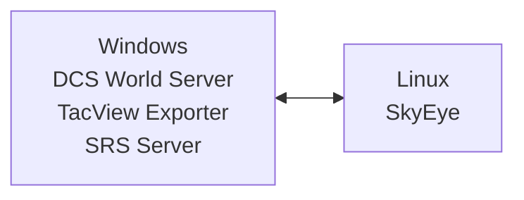

# Deployment

This is a technical article on how to deploy SkyEye, targeted at multiplayer server administrators. It assumes you are a semi-technical user who is comfortable administering a Linux or Windows server. (A more basic quick-start guide will be published at a later date.)

# Planning Your Deployment

## Major Known Issues

- **Medium**: SkyEye will not report about hostile contacts below 50 knots. Unfortunately, this includes hostile helicopters that are moving slowly or hovering. [Bug tracked here](https://github.com/dharmab/skyeye/issues/65).
- See also [this section in the player guide](PLAYER.md#a-word-of-warning) about the bot's limitations.

## System Architecture

SkyEye works best when run on a dedicated system, separate from the DCS World and SRS servers.

_Recommended Architecture: DCS, TacView and SRS on one Windows server. SkyEye on another Linux server._



If you insist on running SkyEye on the same system as DCS, I cannot offer you any guarantees of performance. If you choose to try this anyway, I do recommend configuring Process Affinity to pin SkyEye to a set of dedicated CPU cores separate from any other CPU-intensive software. The easiest way to do this on Windows is by using the [CPU Affinities feature in Process Lasso](https://bitsum.com/processlasso-docs/#default_affinities).

SkyEye will automatically reconnect to TacView if the connection is lost. However, if the connection to SRS is lost, SkyEye will exit. The guides for Linux and Windows provided below include scripts to automatically restart SkyEye after a delay.

## Software

SkyEye is officially supported on Windows and Linux. The Windows version bundles all required libraries within skyeye.exe. The Linux version
requires Opus, SOXR and OpenBLAS to be installed using the OS package manager.

## Hardware

SkyEye requires a fast, multithreaded, **dedicated** CPU, 3GB of RAM, and about 2GB of disk space. The CPU must have support for [AVX2](https://en.wikipedia.org/wiki/Advanced_Vector_Extensions#Advanced_Vector_Extensions_2).

CPU Series|AVX2 Added In
-|-
Intel Core|Haswell (2013)
AMD|Excavator (2015)
Intel Pentium/Celeron|Tiger Lake (2020)

SkyEye currently only officially supports the AMD64 (x86-64) CPU architecture; ARM CPUs are not yet officially supported. I've found that at least 4 dedicated CPU cores are needed for a good experience, but this may differ by the exact CPU being used, so experiment and see what works well for you.

It is important that the CPU cores be **dedicated** cores. Shared core virtual machines are **not supported** and will result in **high latency and stuttering audio.**

Non-scientific speech recognition performance:

System|CPU|Speech Recognition Model|Speech Recognition Time (Synthetic benchmark)|Speech Recognition Time (In practice)
-|-|-|-|-
My current PC|AMD 5900X|ggml-small.en.bin|1.0-1.5s|1.5-2.0s
My older PC|AMD 3900XT|ggml-small.en.bin|2-3s|?
Vultr Optimized Cloud (CPU Optimized)|AMD EPYC Milan (4 dedicated cores)|ggml-small.en.bin|3.0-3.5s|3.0-3.5s
My current PC|AMD 5900X|ggml-medium.en.bin|3.5-4.5s|4-5s
Vultr Optimized Cloud (CPU Optimized)|AMD EPYC Milan (2 dedicated cores)|ggml-small.en.bin|5-6s|5.5-6.0s
Hetzner CCX23|AMD EPYC (4 dedicated cores)|ggml-small.en.bin|5-6s|6-7s
My older PC|AMD 3900XT|ggml-medium.en.bin|6.5-7.5s|?
Vultr Optimized Cloud (CPU Optimized)|AMD EPYC Milan (4 dedicated cores)|ggml-medium.en.bin|9-10s|9-11s
Hetzner CCX13|AMD EPYC (2 dedicated cores)|ggml-small.en.bin|7-8s|12-15s
Vultr Optimized Cloud (CPU Optimized)|AMD EPYC Milan (2 dedicated cores)|ggml-medium.en.bin|?|17.5-18.0s
Hetzner CCX23|AMD EPYC (4 dedicated cores)|ggml-medium.en.bin|16-17s|?

SkyEye does not use the disk very much, so a particularly fast disk is not required.

Examples of suitable servers include:

* [Amazon EC2 Dedicated Instances](https://aws.amazon.com/ec2/pricing/dedicated-instances/)
* GCP Compute Engine `c2d-highcpu-*`, `c3d-highcpu-*`, `c3-highcpu-*`, `c4-highcpu-*` instances
* Hetzner CCX instances
* [Vultr Optimized Cloud Compute (CPU Optmized)](https://www.vultr.com/pricing/#optimized-cloud-compute)
* [Linode Dedicated CPU Instances](https://www.linode.com/pricing/#compute-dedicated)

I won't provide an endorsement of any particular provider, but I will point out that as of August 2024 Hetzner's CCX23 instance is probably the cheapest way the run SkyEye on public cloud. The cheapest way to run SkyEye overall is probably on a spare computer in your house.

## Configuration

SkyEye can be configured using a YAML or JSON configuration file, environment variables and/or command-line flags. The order of priority is:

1. CLI flags
2. Environment variabls
3. Configuration file

That is, environment variables override the config file, and CLI flags override everything.

Command-line flags are documented in the `--help` text. Each flag can be provided directly as a config file key or as a `SKYEYE_` variable. For example, the whisper.cpp model path can be configured on Linux as a flag:

```sh
./skyeye --whisper-model=models/ggml-small.en.bin
```

Or a variable:

```sh
export SKYEYE_WHISPER_MODEL=models/ggml-small.en.bin
./skyeye
```

Or in a config file:

```yaml
whisper_model: models/ggml-small.en.bin
```

The config file's default location is `/etc/skyeye/config.yaml`. You can override this location by setting `--config-file` or `SKYEYE_CONFIG_FILE`.

It is recommended to use the configuration file as the main source of config. Most users find it the easiest option, and a file is simple to protect using access control policies, unlike a processes' environment or arguments.

A sample configuration file is provided in the download which should be customized to fit your needs. It contains many explanatory comments which guide you through customization.

## Speech Recognition

You'll need to choose a whisper.cpp speech recognition model from [Hugging Face](https://huggingface.co/ggerganov/whisper.cpp/tree/main). See the example config file for recommendations on which model to use.

## Networking

Outbound ports typically required by SkyEye:

- `5002/TCP`: SRS Data
- `5002/UDP`: SRS Audio
- `42674/TCP`: TacView Real-Time Telemetry
- `443/TCP`: Discord webhook

SkyEye does not require any inbound ports during runtime.

SkyEye requires a stable connection to the TacView exporter to stream real-time telemetry. If this connection has a data cap, you should monitor the bandwidth usage. If this turns out to be a problem in practice, please create an issue on GitHub and I'll see if I can improve it to meet your needs.

## Logging

I recommend you retain your logs so that you can include them in any bug reports.

On Linux, the easiest way to retain your logs is to run SkyEye as a systemd-managed service. This will automatically retain your logs in the system journal, and you'll be able to query and search the logs using `journalctl -u skyeye`.

On Windows, the easiest way to retain your logs is to use [redirection](https://learn.microsoft.com/en-us/troubleshoot/developer/visualstudio/cpp/language-compilers/redirecting-error-command-prompt).

Advanced users should consider sending their logs to a log aggregator such as [Grafana Cloud](https://grafana.com/products/cloud/logs/). If you do this, I also recommend using `--log-format=json` to log in JSON format, which is easier to search and filter when using an aggregator.

## Tracing

SkyEye includes an optional feature to publish request traces to a Discord channel. This can help players self-troubleshoot issues using the bot.

To enable this feature, first create a webhook in your Discord server (Server Settings > Integrations > Webhooks). Then, set the `enable-tracing`, `discord-webhook-id` and `discord-webhook-token` configuration options in SkyEye.

## Autoscaling (Experimental)

The included `skyeye-scaler` program is an optional autoscaler tool. It monitors a set of frequencies in SRS, and continually sends POST requests to a custom webhook. The webhook URL is defined by setting the `--webhook-url` flag or `SKYEYE_SCALER_WEBHOOK_URL` environment variable.

The body of the POST request is a JSON object with the following fields:

- `action`: Either "run" if there is at least one player on SRS, or "stop" if there are no players on SRS.
- `players`: The number of players on SRS.
- `address`: The address and port of the SRS server being monitored, e.g. "srs.example.com:5002"
- `frequencies`: A list of the SRSs frequencies being monitored. Each element is a float representing the channel's frequency in MHz.

By implementing a small webservice or serverless function that creates or destroys a SkyEye instance on demand, the cost of running SkyEye can be significantly reduced. This is particularly useful for servers that are only active for a few hours a week, such as a private squadron server.

An example WinSW service definition is provided in the Windows release archive. You can edit this example file to include your webhook URL and the frequencies you want to monitor, then install and run it it using the included `skyeye-scaler-service.exe` executable:

```batch
:: Install SkyEye Scaler
./skyeye-scaler-service.exe install

:: Start SkyEye Scaler
./skyeye-scaler-service.exe start

:: Check if SkyEye Scaler is running
./skyeye-scaler-service.exe status

:: Stop SkyEye Scaler
./skyeye-scaler-service.exe stopwait

:: Restart SkyEye Scaler
./skyeye-scaler-service.exe restart

:: Uninstall SkyEye Scaler
./skyeye-scaler-service.exe uninstall
```

The scaler is also available as a container image at `ghcr.io/dharmab/skyeye-scaler`. A Linux binary is also provided in the Linux release archive, although without a service definition.

# Installation

## Linux

### cloud-init

A sample [cloud-init](https://cloudinit.readthedocs.io/en/latest/) config is provided in `/init/cloud-init` directory in the Git repository. This automates the installation and startup on a new cloud server instance. It should be compatible with most Linux distributions including Debian, Ubuntu, Fedora, Arch Linux and OpenSUSE.

See documentation on cloud-init:

- [Official documentation](https://cloudinit.readthedocs.io/en/latest/index.html)
- [AWS](https://docs.aws.amazon.com/AWSEC2/latest/UserGuide/user-data.html#user-data-cloud-init)
- [GCP](https://cloud.google.com/container-optimized-os/docs/how-to/create-configure-instance#using_cloud-init_with_the_cloud_config_format)
- [Hetzer](https://docs.hetzner.cloud/#servers-create-a-server)
- [Linode](https://techdocs.akamai.com/cloud-computing/docs/overview-of-the-metadata-service#add-user-data-when-deploying-a-compute-instance)
- [Vultr](https://docs.vultr.com/how-to-deploy-a-vultr-server-with-cloudinit-userdata)

To customize this cloud-init file:

1. Edit the `content` field of the `/etc/skyeye/config.yaml` file with your desired configuration.
1. If you want to pin to a specific version of SkyEye, replace `ghcr.io/dharmab/skyeye:latest` with the desired version. I strongly recommend you pin the version in case of any breaking changes in the future.

If you wish to change the version of SkyEye in the future:

```sh
# Stop SkyEye
sudo systemctl stop skyeye
# Edit the image.env file to change the image version
sudoedit /etc/skyeye/image.env
# Make any required changes to the configuration
sudoedit /etc/skyeye/config.yaml
# Restart SkyEye
sudo systemctl start skyeye
# Check the logs and check if it seems to be working
journalctl -fu skyeye
```

### Manual Installation

Install shared libraries for [Opus](https://opus-codec.org/), [SoX Resampler](https://sourceforge.net/p/soxr/wiki/Home/) and [OpenBLAS](http://www.openblas.net/) with [OpenMP](https://www.openmp.org/about/openmp-faq/#OMPAPI).

Ubuntu:

```bash
sudo apt-get update
sudo apt-get install libopus0 libsoxr0 libopenblas0-openmp
```

Arch Linux:

```bash
sudo pacman -Syu opus soxr openblas
```

Download SkyEye and an AI model. Copy them to `/opt/skyeye/`. Create a `skyeye` user to run SkyEye.

```bash
sudo useradd -G users skyeye
curl -sL https://github.com/dharmab/skyeye/releases/latest/download/skyeye-linux-amd64.tar.gz -o /tmp/skyeye-linux-amd64.tar.gz
tar -xzf /tmp/skyeye-linux-amd64.tar.gz -C /tmp/
sudo mkdir -p /opt/skyeye/bin
sudo mv /tmp/skyeye-linux-amd64/skyeye /opt/skyeye/bin/skyeye
sudo chmod +x /opt/skyeye/bin/skyeye
sudo mkdir -p /opt/skyeye/models
curl -sL https://huggingface.co/ggerganov/whisper.cpp/resolve/main/ggml-small.en.bin -o /opt/skyeye/models/ggml-small.en.bin
sudo chown -R skyeye:users /opt/skyeye
sudo mkdir -p /etc/skyeye
sudo mv /tmp/skyeye-linux-amd64/config.yaml /etc/skyeye/config.yaml
sudo chmod 600 /etc/skyeye/config.yaml
sudo chown -R skyeye:users /etc/skyeye
```

Save this systemd unit to `/etc/systemd/system/skyeye.service`:

```ini
[Unit]
Description=SkyEye GCI Bot
After=network-online.target

[Service]
Type=simple
User=skyeye
WorkingDirectory=/opt/skyeye
ExecStart=/opt/skyeye/bin/skyeye
Restart=always
RestartSec=60

[Install]
WantedBy=multi-user.target
```

Edit the config file as required using `sudoedit /etc/skyeye/config.yaml`.

### Container

A container image is available at `ghcr.io/dharmab/skyeye`. This image is only functional on Linux; it will not work correctly on Windows or macOS. It is subject to the same dedicated CPU requirements as the native binary. The `skyeye` binary is the container entrypoint. You will need to mount a whisper model into the container.

### Service Management

Use `systemctl` to start the bot:

```bash
# Load changes to skyeye.service file
sudo systemctl daemon-reload

# Start the bot
sudo systemctl start skyeye.service

# Stop the bot
sudo systemctl stop skyeye.service

# Autostart the bot when the system boots
sudo systemctl enable skyeye.service

# Disable autostart on boot
sudo systemctl disable skyeye.service
```

View the logs with `journalctl`:

```bash
# Stream the logs
journalctl -fu skyeye

# Page through recent logs
journalctl -u skyeye

# Save recent logs to a file (handy for bug reports)
journalctl -u skyeye > skyeye.log
```

## Windows

Download the SkyEye release ZIP from the [releases page](https://github.com/dharmab/skyeye/releases) and extract it.

Edit `config.yaml` to configure SkyEye as desired. Note that any provided value of `whisper-model` here is ignored because it is overridden in `skyeye-service.yml`. If you wish to change the whisper.cpp model, edit `skyeye-service.yml`.

If you want SkyEye to automatically start on boot, edit `skyeye-service.yml` and change `startmode` to "Automatic".

Use the bundled `skyeye-service.exe` to install and start SkyEye:

```batch
:: Install SkyEye
./skyeye-service.exe install

:: Start SkyEye
./skyeye-service.exe start

:: Check if SkyEye is running
./skyeye-service.exe status

:: Stop SkyEye
./skyeye-service-x6t4.exe stopwait

:: Restart SkyEye
./skyeye-service.exe restart

:: Uninstall SkyEye
./skyeye-service.exe uninstall
```

Refer to the [WinSW documentation](https://github.com/winsw/winsw/tree/v2.12.0) for more information (`skyeye-service.exe` is a renamed `winsw.exe`).

Logs will be saved in a `skyeye.log` file in the same directory as `skyeye-service.yml`

If you want to change the version of SkyEye in the future:

```batch
:: Stop and Uninstall SkyEye
./skyeye-service.exe stop skyeye-service.yml
./skyeye-service.exe uninstall skyeye-service.yml

:: Download a newer version of SkyEye and replace both skyeye.exe and skyeye-service.yml

:: Install and Start the new version of SkyEye
./skyeye-service.exe install skyeye-service.yml
./skyeye-service.exe start skyeye-service.yml
```
