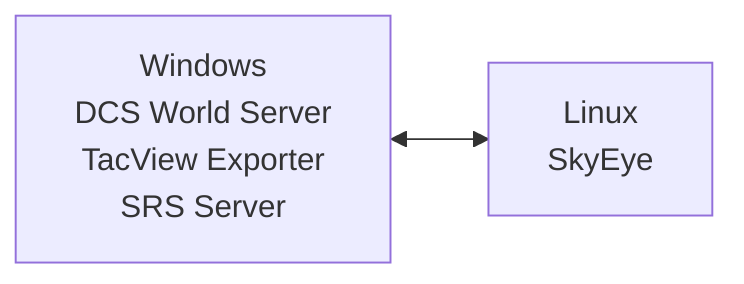

# Deployment

This is a technical article on how to deploy SkyEye, targeted at multiplayer server administrators. It assumes you are a semi-technical user who is comfortable administering a Linux or Windows server. (A more basic quick-start guide will be published at a later date.)

# Planning Your Deployment

## Major Known Issues

- **High**: SkyEye does not automatically reconnect to SRS if the connection is lost. It must be restarted if this happens. [Bug tracked here](https://github.com/dharmab/skyeye/issues/221) This guide recommends using systemd or PowerShell to automatically restart SkyEye.
- **Medium**: SkyEye will not report about hostile contacts below 50 knots. Unfortunately, this includes hostile helicopters that are moving slowly or hovering. [Bug tracked here](https://github.com/dharmab/skyeye/issues/65).
- See also [this section in the player guide](PLAYER.md#a-word-of-warning) about the bots' limitations.

## System Architecture

SkyEye works best when run on a dedicated system, separate from the DCS World and SRS servers.

_Recommended Architecture: DCS, TacView and SRS on one Windows server. SkyEye on another Linux server._



If you insist on running SkyEye on the same system as DCS, I cannot offer you any guarantees of performance. I do recommend configuring Process Affinity to pin SkyEye to a set of dedicated CPU cores separate from any other CPU-intensive software. The easiest way to do this on Windows is by using the [CPU Affinities feature in Process Lasso](https://bitsum.com/processlasso-docs/#default_affinities).

SkyEye will automatically reconnect to TacView if the connection is lost. However, if the connection to SRS is lost, SkyEye will exit. The guides for Linux and Windows provided below include scripts to automatically restart SkyEye after a delay.

## Hardware

SkyEye requires a fast, multithreaded, **dedicated** CPU, 3GB of RAM, and about 2GB of disk space. The CPU must have support for [AVX2](https://en.wikipedia.org/wiki/Advanced_Vector_Extensions#Advanced_Vector_Extensions_2).

SkyEye currently only officially supports the x86-64/AMD64 CPU architecture; ARM CPUs are not yet officially supported. I've found that at least 4 dedicated CPU cores are needed for a good experience, but this may differ by the exact CPU being used, so experiment and see what works well for you.

It is important that the CPU cores be **dedicated** cores. Shared core virtual machines are **not supported** and will result in **high latency and stuttering audio.**

SkyEye does not use the disk very much, so a particularly fast disk is not required.

Examples of suitable servers include:

* [Amazon EC2 Dedicated Instances](https://aws.amazon.com/ec2/pricing/dedicated-instances/)
* GCP Compute Engine `c2d-highcpu-*`, `c3d-highcpu-*`, `c3-highcpu-*`, `c4-highcpu-*` instances
* Hetzner CCX instances
* [Linode Dedicated CPU Instances](https://www.linode.com/pricing/#compute-dedicated)

I won't provide an endorsement of any particular provider, but I will point out that as of August 2024 Hetzner's CCX23 instance is probably the cheapest way the run SkyEye on public cloud. The cheapest way to run SkyEye overall is probably on a spare computer in your house.

## Configuration

Skyeye can be configured using a YAML or JSON configuration file, environment variables and/or command-line flags. The order of priority is:

1. CLI flags
2. Environment variabls
3. Configuration file

That is, environment variables override the config file, and CLI flags override everything.

Command-line flags are documented in the `--help` text. Each flag can be provided directly as a config file key or as a `SKYEYE_` variable. For example, the whisper.cpp model path can be configured on Linux as a flag:

```sh
./skyeye --whisper-model=models/ggml-small.en.bin
```

Or a variable:

```sh
export SKYEYE_WHISPER_MODEL=models/ggml-small.en.bin
./skyeye
```

Or in a config file:

```yaml
whisper-model: models/ggml-small.en.bin
```

```sh
./skyeye --config-file=config.yaml
```

It is recommended to use the configuration file as the main source of config. Most users find it the easiest option, and a file is simple to protect using access control policies, unlike a processes' environment or arguments.

A sample configuration file is provided in the download which should be customized to fit your needs. It contains many explanatory comments which guide you through customization.

## Speech Recognition

You'll need to choose a whisper.cpp speech recognition model from [Hugging Face](https://huggingface.co/ggerganov/whisper.cpp/tree/main). See the example config file for recommendations on which model to use.

## Networking

Outbound ports typically required by SkyEye:

- `5002/TCP`: SRS Data
- `5002/UDP`: SRS Audio
- `42674/TCP`: TacView Real-Time Telemetry

You may also need `443/TCP` outbound during installation to download from GitHub and Hugging Face.

SkyEye does not require any inbound ports during runtime.

SkyEye requires a stable connection to the TacView exporter to stream real-time telemetry. If this connection has a data cap, you should monitor the bandwidth usage. If this turns out to be a problem in practice, please create an issue on GitHub and I'll see if I can improve it to meet your needs.

## Logging

I recommend you retain your logs so that you can include them in any bug reports.

On Linux, the easiest way to retain your logs is to run SkyEye as a systemd-managed service. This will automatically retain your logs in the system journal, and you'll be able to query and search the logs using `journalctl -u skyeye`.

On Windows, the easiest way to retain your logs is to use [redirection](https://learn.microsoft.com/en-us/troubleshoot/developer/visualstudio/cpp/language-compilers/redirecting-error-command-prompt).

Advanced users should consider sending their logs to a log aggregator such as [Grafana Cloud](https://grafana.com/products/cloud/logs/). If you do this, I also recommend using `--log-format=json` to log in JSON format, which is easier to search and filter when using an aggregator.

# Installation

## Linux

### cloud-init

A sample [cloud-init](https://cloudinit.readthedocs.io/en/latest/) config is provided in `/init/cloud-init` directory in the Git repository. This automates the installation and startup on a new cloud server instance running Ubuntu. It can also be modified to work on other Linux distros with minor tweaks.

### Manual Installation

Install shared libraries for [Opus](https://opus-codec.org/), [SoX Resampler](https://sourceforge.net/p/soxr/wiki/Home/) and [OpenBLAS](http://www.openblas.net/) with [OpenMP](https://www.openmp.org/about/openmp-faq/#OMPAPI).

Ubuntu:

```bash
sudo apt-get update
sudo apt-get install libopus0 libsoxr0 libopenblas0-openmp
```

Arch Linux:

```bash
sudo pacman -Syu opus soxr openblas
```

Download SkyEye and an AI model. Copy them to `/opt/skyeye/`. Create a `skyeye` user to run SkyEye.

```bash
useradd -G users skyeye
curl -sL https://github.com/dharmab/skyeye/releases/latest/download/skyeye-linux-amd64.tar.gz -o /tmp/skyeye-linux-amd64.tar.gz
tar -xzf /tmp/skyeye-linux-amd64.tar.gz -C /tmp/
mkdir -p /opt/skyeye/bin
mv /tmp/skyeye-linux-amd64/skyeye /opt/skyeye/bin/skyeye
chmod +x /opt/skyeye/bin/skyeye
mkdir -p /opt/skyeye/models
curl -sL https://huggingface.co/ggerganov/whisper.cpp/resolve/main/ggml-small.en.bin -o /opt/skyeye/models/ggml-small.en.bin
chown -R skyeye:users /opt/skyeye
mkdir -p /etc/skyeye
mv /tmp/skyeye-linux-amd64/config.yaml /etc/skyeye/config.yaml
chmod 600 /etc/skyeye/config.yaml
chown -R skyeye:users /etc/skyeye
```

Save this systemd unit to `/etc/systemd/system/skyeye.service`:

```ini
[Unit]
Description=SkyEye GCI Bot
After=network-online.target

[Service]
Type=simple
User=skyeye
WorkingDirectory=/opt/skyeye
ExecStart=/opt/skyeye/bin/skyeye
Restart=always
RestartSec=60

[Install]
WantedBy=multi-user.target
```

Edit the config file as required using `sudoedit /etc/skyeye/config.yaml`.

### Container (Experimental)

An experimental container image is available at `ghcr.io/dharmab/skyeye`. This image is only functional on Linux; it will not work correctly on Windows or macOS. It is subject to the same dedicated CPU requirements as the native binary.

### Service Management

Use `systemctl` to start the bot:

```bash
# Load changes to skyeye.service file
sudo systemctl daemon-reload

# Start the bot
sudo systemctl start skyeye.service

# Stop the bot
sudo systemctl stop skyeye.service

# Autostart the bot when the system boots
sudo systemctl enable skyeye.service

# Disable autostart on boot
sudo systemctl disable skyeye.service
```

View the logs with `journalctl`:

```bash
# Stream the logs
journalctl -fu skyeye.exe

# Page through recent logs
journalctl -u skyeye
```

## Windows

I don't know much about Windows Server administration. If there's a better way to do this please get in touch.

Download the SkyEye release ZIP from the [releases page](https://github.com/dharmab/skyeye/releases) and extract it. Download the whisper.cpp model from [Hugging Face](https://huggingface.co/ggerganov/whisper.cpp/tree/main) and move it next to `skyeye.exe`.

Edit `config.yaml` to configure SkyEye as desired.

Open Powershell, change to the SkyEye directory and run the script with `./run-skyeye.ps1`.  SkyEye will automatically restart if it exits; press Ctrl+C to exit manually.

Logs will be saved in the `.log` files in the `logs` directory. Remember to regularly compress and/or delete old log files so they don't fill up the disk.
