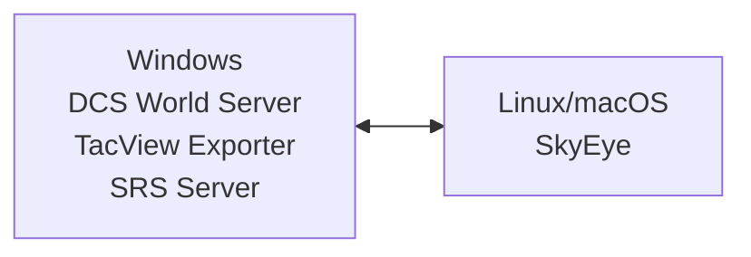
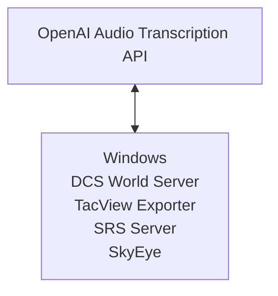

# Deployment

This is a technical article on how to deploy SkyEye, targeted at multiplayer server administrators. It assumes you are a semi-technical user who is comfortable administering a Linux or Windows server.

For an easier step-by-step guide, see one of the quickstart guides:

- [Windows](QUICKSTART-WINDOWS.md)
- [macOS](QUICKSTART-MACOS.md)
- [Linux on Hetzner Cloud](QUICKSTART-HETZNER.md)
- [Linux on Vultr](QUICKSTART-VULTR.md)

# Getting Help

If you need help with SkyEye, create a [GitHub issue](https://github.com/dharmab/skyeye/issues).

I do not respond to direct messages on social media or the Eagle Dynamics forums. I dislike social media and use the minimal amount necessary for my projects and hobbies; I'd prefer to not use it at all.

# Planning Your Deployment

## Major Known Issues

- SkyEye will not report about hostile contacts below 50 knots. Unfortunately, this includes hostile helicopters that are moving slowly or hovering. [Bug tracked here](https://github.com/dharmab/skyeye/issues/65).
- SkyEye does not work when (1) running on macOS 15 AND (2) as a background service AND (3) connecting to a SRS, Tacview, or DCS-gRPC server running within the same LAN. [Bug tracked here, multiple workarounds available](https://github.com/dharmab/skyeye/issues/566).
- See also [this section in the player guide](PLAYER.md#a-word-of-warning) about the bot's limitations.

## System Architecture

SkyEye can be deployed in two architectures: Local speech recognition and cloud-hosted speech recognition. Neither is universally better than the other; they each suit different use cases.

Local speech recognition is more performance intensive, usually requiring two computers with quite good CPUs (one to run DCS and one to run SkyEye). However, it has a number of advantages:

- Local speech recognition generally has a predictable fixed cost; it costs the same whether players talk only a little or chatter a lot. This makes hosting costs more predictable and reduces the impact a of a malicious or abusive player.
- Local speech recognition is fully self-contained. It has better privacy qualities, and you can expect it to continue to work far into the future.
- Local speech recognition can be self-hosted on your own hardware. This makes it a viable option for some international groups whose payment methods are not accepted by cloud hosting providers.
- If you have very powerful hardware, self-hosting can be lower-latency and/or cheaper than cloud speech recognition.
- If you have a Mac with an Apple Sillicon CPU, local speech recognition is the best option, since it uses the GPU/Neural Engine for extremely fast performance.

On the other hand, cloud speech recognition has a separate set of tradeoffs:

- Less technical users will likely prefer cloud speech recognition, since it requires only one computer instead of two networked together.
- Cloud speech recognition has a variable cost; this can be an advantage or disadvantage. In general, light to moderate usage is less expensive when using cloud speech recognition compared to using local speech recognition on a rented server. However, this can still be more expensive compared to self-hosted local speech recognition, or if you have a particularly chatty group of players. On public servers, there is a potential for abuse if a particular player spams the channel and racks up the cloud services bill. And of course, the company providing the service may choose to change their prices in the future.
- Cloud speech recognition shares audio recordings with a third party, which may be a privacy concern.
- Cloud speech recognition depends on an externally hosted API. It could break temporarily or permanently if the external API has an outage, makes a breaking change, or the company decides to stop providing the service to you.
- Cloud speech recognition has good performance; while local speech recognition can be faster, in practice most players will be satisfied with the performance of cloud speech recognition.
- When using cloud speech recognition, you have a **legal obligation** to disclose to your players that they are interacting with AI. (ref: [OpenAI Usage Policies](https://openai.com/policies/usage-policies/)). Of course, you should be doing this anyway! I recommend adding a disclosure to your mission briefing, and enabling "Show Transmitter Name" in your SRS server.

### Deployment with Local Speech Recognition

When using local speech recognition, SkyEye works best when run on a dedicated system, separate from the DCS World and SRS servers.

_Recommended Architecture: DCS, TacView and SRS on one Windows server. SkyEye on another Linux or macOS server._



#### Caution: Running SkyEye and DCS World on One Computer

**Running SkyEye with local speech recognition on the same computer as DCS World is not intended and probably won't work. I cannott provide support for this configuration.** Even if I wanted to support this configuration, I do not have the appropriate tools to troubleshoot _your specific hardware configuration_. It's difficult enough to troubleshoot these kinds of issues when the hardware is physically in front of me and I have full admin access. Trying to troubleshoot a non-technical user's hardware remotely is impossible. (This is a big reason AI applications, including SkyEye, are so much better on Apple devices; standardized hardware is much easier to support.)

**If you open a GitHub Issue regarding performance issues with this configuration, I will tell you to use a second computer or switch to cloud speech recognition.** Almost every report I've received about performance issues with SkyEye have been from users attempting to run SkyEye's local speech recognition on the same computer as DCS World, which is **not an intended way to run SkyEye**. 😾

If you have read all of the above, and are still serious about, attempting this, here is the best advice I have:

1. [Watch this talk by Xe Iaso about running AI workloads using local infrastructure](https://xeiaso.net/talks/2025/ai-chatbot-friends/). It's a good primer on the complexity of the problem you're trying to ignore.
2. If, after watching that talk, you still want to try this, click the button for some hints:

<details>
  <summary>I understand what I'm about to try is not supported and probably won't work</summary>

  If you choose to try this anyway, configure Process Affinity to pin SkyEye to a set of dedicated CPU cores separate from any other CPU-intensive software. The easiest way to do this on Windows is by using the [CPU Affinities feature in Process Lasso](https://bitsum.com/processlasso-docs/#default_affinities).

</details>

Running SkyEye with cloud speech recognition on the same computer as DCS World _is_ supported. 🤗

### Deployment with Cloud Speech Recognition

When using cloud speech recognition, you may deploy SkyEye on the same computer as DCS World and the SRS server.



## Software

SkyEye is officially supported on Windows AMD64, Linux AMD64 and Apple Silicon. The Windows version bundles all required libraries within skyeye.exe. The Linux and macOS versions require [Opus](https://opus-codec.org/) and [SoX Resampler](https://sourceforge.net/p/soxr/wiki/Home/) to be installed through the package manager or Homebrew, respectively.

## Hardware

### Cloud Speech Recognition

When using cloud speech recognition, SkyEye has relatively modest requirements: Any decent multithreaded CPU, around 1.5GB of RAM, and about 2GB of disk space.

### Local Speech Recognition

#### Windows and Linux

When running on Windows and Linux, local speech recognition runs on the CPU. In this configuration, SkyEye requires a fast, multithreaded, **dedicated** CPU, 3GB of RAM, and about 2GB of disk space. The CPU must have support for [AVX2](https://en.wikipedia.org/wiki/Advanced_Vector_Extensions#Advanced_Vector_Extensions_2).

CPU Series|AVX2 Added In
-|-
Intel Core|Haswell (2013)
AMD|Excavator (2015)
Intel Pentium/Celeron|Tiger Lake (2020)

SkyEye currently only officially supports the AMD64 (x86-64) CPU architecure on Windows and Linux. ARM CPUs are not yet officially supported on these operating systems.

I've found that at least 4 dedicated CPU cores are needed for a good experience, but this may differ by the exact CPU being used, so experiment and see what works well for you. It is important that the CPU cores be **dedicated** cores. Shared core virtual machines are **not supported** and will result in **high latency and stuttering audio.**

#### macOS

When running on macOS, local speech recognition uses the GPU/Neural Engine. Therefore, SkyEye does not use much CPU and should run very well on any Apple Silicon Mac. SkyEye requires around 3GB of RAM and about 2GB of disk space.

Intel Macs are not supported due to lack of available hardware for testing.

#### Benchmarks

Non-scientific local speech recognition performance:

System|CPU|Speech Recognition Model|Speech Recognition Time (Synthetic benchmark)|Speech Recognition Time (In practice)
-|-|-|-|-
Macbook Pro|Apple M4 Max|ggml-small.en.bin|0.09-0.13s|?
Mac Mini|Apple M4|ggml-small.en.bin|0.25-0.5s|?
Macbook Pro|Apple M4 Max|ggml-medium.en.bin|0.3-0.5s|?
Macbook Air|Apple M4|ggml-small.en.bin|0.35-0.5s|0.5s
Mac Mini|Apple M4|ggml-medium.en.bin|0.9-1.0s|?
Macbook Air|Apple M4|ggml-medium.en.bin|1.1-1.5s|1.2-1.5s
My current PC|AMD 5900X|ggml-small.en.bin|1.0-1.5s|1.5-2.0s
My older PC|AMD 3900XT|ggml-small.en.bin|2-3s|?
Vultr Optimized Cloud (CPU Optimized)|AMD EPYC Milan (4 dedicated cores)|ggml-small.en.bin|3.0-3.5s|3.0-3.5s
My current PC|AMD 5900X|ggml-medium.en.bin|3.5-4.5s|4-5s
Vultr Optimized Cloud (CPU Optimized)|AMD EPYC Milan (2 dedicated cores)|ggml-small.en.bin|5-6s|5.5-6.0s
Hetzner CCX23|AMD EPYC (4 dedicated cores)|ggml-small.en.bin|5-6s|6-7s
My older PC|AMD 3900XT|ggml-medium.en.bin|6.5-7.5s|?
Vultr Optimized Cloud (CPU Optimized)|AMD EPYC Milan (4 dedicated cores)|ggml-medium.en.bin|9-10s|9-11s
Hetzner CCX13|AMD EPYC (2 dedicated cores)|ggml-small.en.bin|7-8s|12-15s
Vultr Optimized Cloud (CPU Optimized)|AMD EPYC Milan (2 dedicated cores)|ggml-medium.en.bin|?|17.5-18.0s
Hetzner CCX23|AMD EPYC (4 dedicated cores)|ggml-medium.en.bin|16-17s|?

SkyEye does not use the disk very much, so a particularly fast disk is not required.

Examples of suitable servers include:

* [Amazon EC2 Dedicated Instances](https://aws.amazon.com/ec2/pricing/dedicated-instances/)
* GCP Compute Engine `c2d-highcpu-*`, `c3d-highcpu-*`, `c3-highcpu-*`, `c4-highcpu-*` instances
* Hetzner CCX instances
* [Vultr Optimized Cloud Compute (CPU Optimized)](https://www.vultr.com/pricing/#optimized-cloud-compute)
* [Linode Dedicated CPU Instances](https://www.linode.com/pricing/#compute-dedicated)

I won't provide an endorsement of any particular provider, but I will point out that as of August 2024 Hetzner's CCX23 instance is probably the cheapest way the run SkyEye on public cloud. The cheapest way to run SkyEye overall is probably on a spare computer in your house.

## Configuration

SkyEye can be configured using a YAML or JSON configuration file, environment variables and/or command-line flags. The order of priority is:

1. CLI flags
2. Environment variables
3. Configuration file

That is, environment variables override the config file, and CLI flags override everything.

Command-line flags are documented in the `--help` text. Each flag can be provided directly as a config file key or as a `SKYEYE_` variable. For example, the log level can be configured on Linux as a flag:

```sh
./skyeye --log-level=debug
```

Or a variable:

```sh
export SKYEYE_LOG_LEVEL=debug
./skyeye
```

Or in a config file:

```yaml
log-level: debug
```

The config file's default location on Linux is `/etc/skyeye/config.yaml`. You can override this location by setting `--config-file` or `SKYEYE_CONFIG_FILE`. On Windows, the installer uses a `config.yaml` file within the same directory as `skyeye.exe`.

It is recommended to use the configuration file as the main source of config. Most users find it the easiest option, and a file is simple to protect using access control policies, unlike a processes' environment or arguments.

A sample configuration file is provided in the download which should be customized to fit your needs. It contains many explanatory comments which guide you through customization.

## Speech Recognition

### Cloud Speech Recognition

You'll need to set up an account and organization for [OpenAI's API platform](https://openai.com/api/) and obtain an API key. Then configure both `recognizer` and `openai-api-key` in `config.yaml`:

```yaml
recognizer: openai-whisper-api
openai-api-key: APIKEYGOESHERE
```

Valid values for `recognizer` are `openai-whisper-api`, `openai-gpt4o` and `openai-gpt4o-mini`. I do not recommend using the GPT4o options at this time, because the GPT4o models lack support for a feature called [prompting](https://platform.openai.com/docs/guides/speech-to-text#prompting) which SkyEye uses to drastically improve recognition of air combat brevity. In playtesting, the Whisper models currently provide significantly better results than the GPT4o models.

### Local Speech Recognition

You'll need to choose a whisper.cpp speech recognition model from [Hugging Face](https://huggingface.co/ggerganov/whisper.cpp/tree/main). See the example config file for recommendations on which model to use.

Example configuration

```yaml
recognizer: openai-whisper-local
whisper-model: whisper.bin
```

## Speech Synthesis

### Windows and Linux

SkyEye bundles two AI generated voices on Windows and Linux:

* An Irish English feminine voice, based on ["Jenny" by Dioco](https://github.com/dioco-group/jenny-tts-dataset)
* A British English masculine voice, based on [Alan Pope](https://popey.com/blog/)

You can select between these voices using the `voice` configuration option. If you do not select a voice, the two voices are rotated based on the wall clock time when SkyEye is started.

### macOS

SkyEye uses AI generated voices built into macOS.

By default, the "Samantha" voice is used. This is the version of Siri's voice from the iPhone 4s, iPhone 5 and iPhone 6, based on [Susan Bennett](https://susancbennett.com/).

It is also possible to use one of the newer Siri voices, which provide much better quality. **I strongly recommend enabling one of the newer voices.**, because they provide excellent quality, nearly indistinguishable from a human voice.

This procedure was tested on macOS 15.4 Sequoia.

1. Open System settings
2. Click on "Accessibility"
3. Click on "Spoken Content"
4. If the system language is not English, set the system speech language to English
5. Next to "System Voice", click the "i" button
6. In the list of languages, make sure "English" is selected
7. Click on "Voice"
8. Scroll down to "Siri".
9. Listen to the previews and download a Siri voice you like. I've found that of the 5 US English voices, Voice 5 sounds best, and Voice 1 and Voice 2 are acceptable, but Voice 3 and Voice 4 have a strange pronunciation of the word "bullseye."
10. Click "Done"
11. Set the system voice to your choice of Siri voice

To test your change, open Terminal and run this command:

```sh
say "Hello! This should be read in the voice you chose."
```

Finally, to use the selected voice instead of Samantha, set SkyEye's `use-system-voice` configuration option to `true`.

## Networking

Outbound ports typically required by SkyEye:

- `5002/TCP`: SRS Data
- `5002/UDP`: SRS Audio
- `42674/TCP`: TacView Real-Time Telemetry
- `443/TCP`: OpenAI Platform API, Discord webhook

SkyEye does not require any inbound ports during runtime.

SkyEye requires a stable connection to the TacView exporter to stream real-time telemetry. If this connection has a data cap, you should monitor the bandwidth usage. If this turns out to be a problem in practice, please create an issue on GitHub and I'll see if I can improve it to meet your needs.

## Logging

I recommend you retain your logs so that you can include them in any bug reports.

On Linux, the easiest way to retain your logs is to run SkyEye as a systemd-managed service. This will automatically retain your logs in the system journal, and you'll be able to query and search the logs using `journalctl -u skyeye`.

On macOS, the easiest way to retain your logs is to pipe the output of SkyEye to a file using `tee`.

On Windows, SkyEye is bundled with WinSW and a service configuration file which will log to a file.

Advanced users should consider sending their logs to a log aggregator such as [Grafana Cloud](https://grafana.com/products/cloud/logs/). If you do this, I also recommend using `--log-format=json` to log in JSON format, which is easier to search and filter when using an aggregator.

## Tracing

SkyEye includes an optional feature to publish request traces to a Discord channel. This can help players self-troubleshoot issues using the bot.

To enable this feature, first create a webhook in your Discord server (Server Settings > Integrations > Webhooks). Then, set the `enable-tracing`, `discord-webhook-id` and `discord-webhook-token` configuration options in SkyEye.

## Autoscaling (Experimental)

The included `skyeye-scaler` program is an optional autoscaler tool. It monitors a set of frequencies in SRS, and continually sends POST requests to a custom webhook. The webhook URL is defined by setting the `--webhook-url` flag or `SKYEYE_SCALER_WEBHOOK_URL` environment variable.

The body of the POST request is a JSON object with the following fields:

- `action`: Either "run" if there is at least one player on SRS, or "stop" if there are no players on SRS.
- `players`: The number of players on SRS.
- `address`: The address and port of the SRS server being monitored, e.g. "srs.example.com:5002"
- `frequencies`: A list of the SRS frequencies being monitored. Each element is a float representing the channel's frequency in MHz.

By implementing a small webservice or serverless function that creates or destroys a SkyEye instance on demand, the cost of running SkyEye can be significantly reduced. This is particularly useful for servers that are only active for a few hours a week, such as a private squadron server.

An example WinSW service definition is provided in the Windows release archive. You can edit this example file to include your webhook URL and the frequencies you want to monitor, then install and run it it using the included `skyeye-scaler-service.exe` executable:

```batch
:: Install SkyEye Scaler
./skyeye-scaler-service.exe install

:: Start SkyEye Scaler
./skyeye-scaler-service.exe start

:: Check if SkyEye Scaler is running
./skyeye-scaler-service.exe status

:: Stop SkyEye Scaler
./skyeye-scaler-service.exe stopwait

:: Restart SkyEye Scaler
./skyeye-scaler-service.exe restart

:: Uninstall SkyEye Scaler
./skyeye-scaler-service.exe uninstall
```

The scaler is also available as a container image at `ghcr.io/dharmab/skyeye-scaler`. A Linux binary is also provided in the Linux release archive, although without a service definition.

## Multiple Instances (Experimental)

You may want to run multiple instances of SkyEye on the same CPU:

- Running a separate instance for each of the Blue and Red coalitions
- Running multiple controllers for different radio frequencies
- Running multiple instances for different servers

There is a potential performance issue that could occur if two or more instances attempt to run an AI model at the same moment. Depending on how talkative your players are, this might be a rare occurrence, or it might be near constantly happening. You can mitigate this by configuring the `recognizer-lock-path` and `voice-lock-path` flags. Each of these is a file path where SkyEye will create and acquire a lock file before running the STT or TTS model, respectively. If the lock cannot be acquired in a reasonable time, SkyEye will abort handling that particular transmission. By configuring all instances to use the same lock path, you can ensure that only one instance is running the AI model at a time.

Note that `recognizer-lock-path` should only be used if you are using local speech recognition. It is harmful when using cloud speech recognition.

Also note that TTS is pretty fast in practice and you might not need to set `voice-lock-path`. Test your hardware with and without this lock and see if it's necessary. Using the lock may delay the controller's responses, so if you don't need it, don't use it.

If you are not running multiple instances, these locks are harmful to performance and should not be used. This can especially be a problem if your machine has a slow or busy disk.

Be aware that it is technically possible for the file lock to become deadlocked in some cases, such as if SkyEye is unable to exit cleanly. If you use this feature you should monitor the logs and traces for errors related to lock acquisition. You may need to manually resolve a deadlock by stopping down all SkyEye instances, deleting the lock file and restarting the instances.

This architecture is marked experimental because I don't test this configuration. You are responsible for testing these features on your hardware.

Lastly, I cannot predict how these locks work in combination with CPU Core Affinity/Process Lasso. I suspect results will vary depending on the CPU's core and cache layout. To repeat and emphasize: **Core Affinity/Process Lasso configurations have no guarantees of performance and are at your own risk.**

# Installation

You will need to install the Tacview Exporter in your DCS server. Use the official TacView client to verify that you can connect to the Real-Time Telemetry address and port. (Real-Time Telemetry is a paid feature of the Tacview client, but is available in the free trial if you don't have a paid license.)

You will need to enable External AWACS Mode (EAM) in your SRS server settings and configure an EAM password for the coalition(s) you want SkyEye to serve (i.e. configure the blue password for SkyEye to provide GCI to blue players).

## Linux

_Note: I am planning to improve the installation on Linux by creating a method to install and run SkyEye using [podman-systemd](https://docs.podman.io/en/latest/markdown/podman-systemd.unit.5.html)._

### Automated Installation with Container Image

A sample [cloud-init](https://cloudinit.readthedocs.io/en/latest/) config is provided in the `/init/cloud-init` directory in the Git repository ([direct link](https://raw.githubusercontent.com/dharmab/skyeye/refs/heads/main/init/cloud-init/cloud-config.yaml)). This automates the installation and startup on a new cloud server instance, using the container `ghcr.io/dharmab/skyeye`. It should be compatible with most Linux distributions including Debian, Ubuntu, Fedora, Arch Linux and OpenSUSE.

See documentation on cloud-init:

- [Official documentation](https://cloudinit.readthedocs.io/en/latest/index.html)
- [AWS](https://docs.aws.amazon.com/AWSEC2/latest/UserGuide/user-data.html#user-data-cloud-init)
- Hetzner: [GUI](https://docs.hetzner.com/cloud/servers/getting-started/creating-a-server), [API](https://docs.hetzner.cloud/#servers-create-a-server)
- [Linode](https://techdocs.akamai.com/cloud-computing/docs/add-user-data-when-deploying-a-compute-instance)
- [Vultr](https://docs.vultr.com/how-to-deploy-a-vultr-server-with-cloudinit-userdata)

To customize this cloud-init file:

1. Edit the `content` field of the `/etc/skyeye/config.yaml` file with your desired configuration.
1. If you want to pin to a specific version of SkyEye, replace `ghcr.io/dharmab/skyeye:latest` with the desired version. I strongly recommend you pin the version in case of any breaking changes in the future.

If you wish to change the version of SkyEye in the future:

```sh
# Edit the image.env file to change the image version
sudoedit /etc/skyeye/image.env
# Restart SkyEye
sudo systemctl restart skyeye
```

> Note: The container image is only supported on Linux; it will not work correctly on macOS or Windows because of CPU latency requirements.

### Manual Installation with Native Binary

You can install SkyEye on a Linux server by manually downloading a release and installing it. The instructions below should be compatible with Debian, Ubuntu, Fedora and Arch Linux, and adaptable to other distributions.

Install shared libraries for [Opus](https://opus-codec.org/) and [SoX Resampler](https://sourceforge.net/p/soxr/wiki/Home/):

```sh
# Install shared libraries on Debian/Ubuntu
sudo apt-get update
sudo apt-get install libopus0 libsoxr0

# Install shared libraries on Fedora
sudo dnf install opus sox

# Install shared libraries on Arch Linux
sudo pacman -Syu opus soxr
```

Install SkyEye:

```sh
# Create a user named "skyeye" to run SkyEye
sudo useradd -G users skyeye

# Download the latest version of SkyEye and install to /opt/skyeye
curl -sL https://github.com/dharmab/skyeye/releases/download/latest/skyeye-linux-amd64.tar.gz -o /tmp/skyeye-linux-amd64.tar.gz
tar -xzf /tmp/skyeye-linux-amd64.tar.gz -C /tmp/
sudo mkdir -p /opt/skyeye/bin
sudo mv /tmp/skyeye-linux-amd64/skyeye /opt/skyeye/bin/skyeye
sudo chmod +x /opt/skyeye/bin/skyeye

# Download a Whisper speech recognition model and install it to /opt/skyeye/models
sudo mkdir -p /opt/skyeye/models
curl -sL https://huggingface.co/ggerganov/whisper.cpp/resolve/main/ggml-small.en.bin -o /opt/skyeye/models/ggml-small.en.bin

# Grant the "skyeye" user ownership of the SkyEye installation directory
sudo chown -R skyeye:users /opt/skyeye

# Create a SkyEye config directory and copy the sample config file there.
sudo mkdir -p /etc/skyeye
sudo mv /tmp/skyeye-linux-amd64/config.yaml /etc/skyeye/config.yaml

# Grant the "skyeye" user ownership of the SkyEye config directory
sudo chmod 600 /etc/skyeye/config.yaml
sudo chown -R skyeye:users /etc/skyeye

# Clean up the downloaded files
rm -rf /tmp/skyeye-linux-amd64.tar.gz /tmp/skyeye-linux-amd64
```

Edit the config file as required:

```sh
# Edit the configuration file using the text editor specified in the EDITOR environment variable
sudoedit /etc/skyeye/config.yaml
```

If you are a Linux noob, you can use [micro](https://micro-editor.github.io/) for a friendly experience:

```sh
# Install micro on Ubuntu
sudo apt-get install micro
# Install micro on Arch Linux
sudo pacman -Syu micro

# Edit the configuration file using micro
EDITOR=micro sudoedit /etc/skyeye/config.yaml
```

Save this systemd unit to `/etc/systemd/system/skyeye.service`:

```ini
[Unit]
Description=SkyEye GCI Bot
After=network-online.target

[Service]
Type=simple
User=skyeye
WorkingDirectory=/opt/skyeye
ExecStart=/opt/skyeye/bin/skyeye
Restart=always
RestartSec=60

[Install]
WantedBy=multi-user.target
```

To start SkyEye, and enable it to start on boot:

```sh
# Load changes to skyeye.service file
sudo systemctl daemon-reload
# Configure SkyEye to start on boot, and also start it immediately
sudo systemctl enable skyeye.service --now
```

If you wish to change the version of SkyEye in the future:

```sh
# Remove any old downloads
rm -rf /tmp/skyeye-linux-amd64.tar.gz /tmp/skyeye-linux-amd64
# Set new_version to whichever version you want to change to
new_version=v1.1.4
# Download the new version and replace the SkyEye executable
curl -sL https://github.com/dharmab/skyeye/releases/dowload/$new_version/skyeye-linux-amd64.tar.gz -o /tmp/skyeye-linux-amd64.tar.gz
tar -xzf /tmp/skyeye-linux-amd64.tar.gz -C /tmp/
sudo mv /tmp/skyeye-linux-amd64/skyeye /opt/skyeye/bin/skyeye
sudo chown skyeye:users /opt/skyeye/bin/skyeye
# Restart SkyEye
sudo systemctl start skyeye.service
```

### Service Management

Use `systemctl` to manage SkyEye:

```sh
# Load changes to skyeye.service file
sudo systemctl daemon-reload

# Start the bot
sudo systemctl start skyeye.service

# Stop the bot
sudo systemctl stop skyeye.service

# Autostart the bot when the system boots
sudo systemctl enable skyeye.service

# Disable autostart on boot
sudo systemctl disable skyeye.service
```

View the logs with `journalctl`:

```sh
# Stream the logs
journalctl -fu skyeye

# Page through recent logs
journalctl -u skyeye

# Save recent logs to a file (handy for bug reports)
journalctl -u skyeye > skyeye.log
```

## macOS

### Installation

Install [Homebrew](https://brew.sh).

Install SkyEye. The installation includes the `ggml-small.en.bin` model.

```sh
brew tap dharmab/skyeye
brew install dharmab/skyeye/skyeye
```

Configure SkyEye by editing the config file at `$(brew --prefix)/etc/skyeye/config.yaml` as required.

```sh
$EDITOR "$(brew --prefix)/etc/skyeye/config.yaml"
```

You'll likely want to configure local speech recognition, since on macOS it is as fast or faster than cloud speech recognition:

```yaml
recognizer: openai-whisper-local
whisper-model: /opt/homebrew/share/skyeye/models/ggml-small.en.bin
```

It also also strongly recommended to configure the system voice as documented in [Speech Synthesis section](#speech-synthesis), and configure SkyEye to use the system voice:

```yaml
use-system-voice: true
```

To start SkyEye, and automatically start it on login:

```sh
brew services start dharmab/skyeye/skyeye
```

If you wish to upgrade to the latest version of SkyEye:

```sh
brew update
brew upgrade dharmab/skyeye/skyeye
brew services restart dharmab/skyeye/skyeye
```

### Service Management

Use `brew services` to manage SkyEye:

```sh
# Start the bot without enabling autostart
brew services run dharmab/skyeye/skyeye

# Stop the bot without disabling autostart
brew services kill dharmab/skyeye/skyeye

# Start the bot and enable autostart on login
brew services start dharmab/skyeye/skyeye

# Stop the bot and disable autostart on login
brew services stop dharmab/skyeye/skyeye

# Restart SkyEye
brew services restart dharmab/skyeye/skyeye

# Uninstall SkyEye
brew uninstall dharmab/skyeye/skyeye
```

Logs will be saved to `$(brew --prefix)/var/log/skyeye.log`:

```sh
# Follow logs
tail -f "$(brew --prefix)/var/log/skyeye.log"

# Examine the full log
less "$(brew --prefix)/var/log/skyeye.log"
```

## Windows

Download the SkyEye release ZIP from the [releases page](https://github.com/dharmab/skyeye/releases) and extract it.

Edit `config.yaml` to configure SkyEye as desired. Note that any provided value of `whisper-model` here is ignored because it is overridden in `skyeye-service.yml`. If you wish to change the whisper.cpp model, edit `skyeye-service.yml`.

If you want SkyEye to automatically start on boot, edit `skyeye-service.yml` and change `startmode` to "Automatic".

Use the bundled `skyeye-service.exe` to install and start SkyEye:

```batch
:: Install SkyEye
./skyeye-service.exe install

:: Start SkyEye
./skyeye-service.exe start

:: Check if SkyEye is running
./skyeye-service.exe status

:: Stop SkyEye
./skyeye-service.exe stopwait

:: Restart SkyEye
./skyeye-service.exe restart

:: Uninstall SkyEye
./skyeye-service.exe uninstall
```

Refer to the [WinSW documentation](https://github.com/winsw/winsw/tree/v2.12.0) for more information (`skyeye-service.exe` is a renamed `winsw.exe`).

Logs will be saved in a `skyeye-service.err.log` file in the same directory as `skyeye-service.yml`.

If you want to change the version of SkyEye in the future:

```batch
:: Stop and Uninstall SkyEye
./skyeye-service.exe stopwait skyeye-service.yml
./skyeye-service.exe uninstall skyeye-service.yml

:: Download a newer version of SkyEye and replace both skyeye.exe and skyeye-service.yml

:: Install and Start the new version of SkyEye
./skyeye-service.exe install skyeye-service.yml
./skyeye-service.exe start skyeye-service.yml
```
