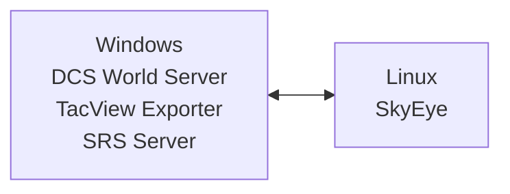

# Deployment

This is a technical article on how to deploy SkyEye, targeted at multiplayer server administrators. It assumes you are a semi-technical user who is comfortable adminsitering a Linux or Windows server. (A more basic quick-start guide will be published at a later date.)

# Planning Your Deployment

## Major Known Issues

- **Medium**: SkyEye will not report about hostile contacts below 50 knots. Unfortunately, this includes hostile helicopters that are moving slowly or hovering. [Bug tracked here](https://github.com/dharmab/skyeye/issues/65).
- See also [this section in the player guide](PLAYER.md#a-word-of-warning) about the bots' limitations.

## System Architecture

SkyEye works best when run on a dedicated system, separate from the DCS World and SRS servers.

_Recommended Architecture: DCS, TacView and SRS on one Windows server. SkyEye on another Linux server._



If you insist on running SkyEye on the same system as DCS, I cannot offer you any guarantees of performance. I do recommend configuring Process Affinity to pin SkyEye to a set of dedicated CPU cores separate from any other CPU-intensive software. The easiest way to do this on Windows is by using the [CPU Affinities feature in Process Lasso](https://bitsum.com/processlasso-docs/#default_affinities).

## Hardware

SkyEye requires a fast, multithreaded, **dedicated** CPU, 3GB of RAM, and about 2GB of disk space. Skyeye currently only officially supports the x86-64/AMD64 CPU architecture; ARM CPUs are not yet officially supported.

It is important that the CPU cores be **dedicated** cores. Shared core virtual machines are **not supported** and will result in **high latency and stuttering audio.**

Examples of suitable servers include:

* [Amazon EC2 Dedicated Instances](https://aws.amazon.com/ec2/pricing/dedicated-instances/)
* GCP Compute Engine `c2d-highcpu-*`, `c3d-highcpu-*`, `c3-highcpu-*`, `c4-highcpu-**` instances
* Hetzner CCX instances
* [Linode Dedicated CPU Instances](https://www.linode.com/pricing/#compute-dedicated)

I won't provide an endorsement of any particular provider, but I will point out that as of August 2024 Hetzner's CCX23 instance is probably the cheapest way the run SkyEye on public cloud. The cheapest way to run SkyEye overall is probably on a spare computer in your house.

## Speech Recognition

You'll need to choose a whisper.cpp speech recognition model from [Hugging Face](https://huggingface.co/ggerganov/whisper.cpp/tree/main). These are my recommendations:

* `ggml-small.en.bin` - My recommendation. Good balance of quality and performance.
* `ggml-medium.en.bin` - Try this if you have powerful hardware, especially a dedicated PC in your house with a powerful CPU with many cores.
* `ggml-tiny.en.bin` - Only if the small model is too slow. Expect poor speech recognition accuracy.

## Networking

Outbound ports typically required by SkyEye:

- `5002/TCP`: SRS Data
- `5002/UDP`: SRS Audio
- `42674/TCP`: TacView Real-Time Telemetry

You may also need `443/TCP` outbound during installation to download from GitHub and Hugging Face.

SkyEye does not require any inbound ports during runtime.

SkyEye requires a stable connection to the TacView exporter to stream real-time telemetry. If this connection has a data cap, you should monitor the bandwidth usage. If this turns out to be a problem in practice, please create an issue on GitHub and I'll see if I can improve it to meet your needs.

## Logging

I recommend you retain your logs so that you can include them in any bug reports.

On Linux, the easiest way to retain your logs is to run SkyEye as a systemd-managed service. This will automatically retain your logs in the system journal, and you'll be able to query and search the logs using `journalctl -u skyeye`.

On Windows, the easier way to redirect the logs is to use [redirection](https://learn.microsoft.com/en-us/troubleshoot/developer/visualstudio/cpp/language-compilers/redirecting-error-command-prompt).

Advanced users should consider sending their logs to a log aggregator such as [Grafana Cloud](https://grafana.com/products/cloud/logs/). If you do this, I also recommend using `--log-format=json` to log in JSON format, which is easier to search and filter when using an aggregator.

## Gameplay Configuration

There's a few options you'll choose when running the bot. You can see all available options using `--help`.

### Coalition

If you use the REDFOR coalition for players, pass the `--coalition=red` flag.

Note: SkyEye is not recommended for PvP use at this time, as it sees and reports information that breaks gameplay balance.

### Callsign

`--callsign` or `--callsigns` should be set to whatever you want the bot to use as it's AWACS callsign. Good callsigns should be in English, two or three syllables, and easy to pronounce. Real world examples include:

* Baron
* Chalice
* Darkstar
* Disco
* Focus
* Goliath
* Magic
* Sentry
* Wizard

I ask that you do _not_ use the callsign "Overlord" to avoid any possible confusion with RurouniJones' OverlordBot. I do not want any confused players filing bug reports to the wrong project!

### Frequency

The `--srs-frequency` flag selects the SRS frequency the bot will serve. Be sure to choose a frequency that all aircraft in your mission can tune on their radios. Remember that some aircraft cannot manually tune some of their radios, so you may need to choose a frequency matching a mission editor preset.

### PICTURE

By default, the bot broadcasts an updated PICTURE if a PICTURE has not been given for two minutes. I find this feature works very well for smaller missions like Retribution campaigns, where the PICTURE helps maintain situational awareness. However, I understand that on a large server with lots of enemy aircraft this could become annoying, so the feature is customizable.

To change the interval, use `--auto-picture-interval`. To set the interval to 3 minutes, use `--auto-picture-interval=3m`. I find values between 2 minutes and 5 minutes work best.

To disable this feature, use `--auto-picture=false`. Players will still be able to request a picture on demand, but the bot won't automatically broadcast them.

### THREAT Monitoring

The bot automatically begins monitoring any friendly aircraft which tunes onto its SRS frequency. It broadcasts THREAT calls if an enemy aircraft approaches close enough to a monitored friendly aircraft to satisfy threat criteria. The threat criteria are dynamic; for example, a Su-27 Flanker is considered a threat at a longer range than a Su-17 Fitter.

You can change the range at which _any_ hostile air-to-air-capable aircraft is considered a threat using the `--mandatory-threat-radius` flag. The default is a reasonable choice for a modern setting, but you may wish to tune this based on mission requirements.

THREAT calls are repeated if the threat critera are still met after a cooldown period. You can change how often the bot rebroadcasts THREAT calls using `--threat-monitoring-interval`. To change this to every 90 seconds, use `--threat-monitoring-interval=1m30s`.

Finally, you can disable this feature entirely with `--threat-monitoring=false`. I advise against this, since it greatly decreases situational awareness, but it's your video game and I'm not your dad.

# Installation

## Linux

### cloud-init

A [cloud-init](https://cloudinit.readthedocs.io/en/latest/) config is provided in `/init/cloud-init` directory in the Git repository. This automates the installation and startup on a new cloud server instance.

### Manual Installation

Install libopus and libsoxr.

Ubuntu:

```bash
sudo apt-get update
sudo apt-get install libopus0 libsoxr0
```

Arch Linux:

```bash
sudo pacman -Syu opus soxr
```

Download SkyEye and an AI model. Copy them to `/opt/skyeye/`. Create a `skyeye` user to run SkyEye.

```bash
useradd -G users skyeye
curl -sL https://github.com/dharmab/skyeye/releases/latest/downloadyeye-linux-amd64.tar.gz -o /tmp/skyeye-linux-amd64.tar.gz
tar -xzf /tmp/skyeye-linux-amd64.tar.gz -C /tmp/
mkdir -p /opt/skyeye/bin
mv /tmp/skyeye-linux-amd64/skyeye /opt/skyeye/bin/skyeye
chmod +x /opt/skyeye/bin/skyeye
mkdir -p /opt/skyeye/models
curl -sL https://huggingface.co/ggerganov/whisper.cpp/resolve/mainml-small.en.bin -o /opt/skyeye/models/ggml-small.en.bin
chown -R skyeye:users /opt/skyeye
```

Edit this systemd unit to configure SkyEye as desired. Save it to `/etc/systemd/system/skyeye.service`:

```ini
[Service]
Type=simple
User=skyeye
WorkingDirectory=/opt/skyeye
ExecStart=/opt/skyeye/bin/skyeye \
--callsign=Focus \
--telemetry-address=your-tacview-address:42674 \
--telemetry-password=your-telemetry-password \
--srs-server-address=your-srs-server:5002 \
--srs-eam-password=your-srs-password \
--srs-frequency=135.0 \
--whisper-model=/opt/skyeye/models/ggml-small.en.bin
Restart=always
RestartSec=60

[Install]
WantedBy=multi-user.target
```

### Service Management

Use `systemctl` to start the bot:

```bash
# Load changes to skyeye.service file
sudo systemctl daemon-reload

# Start the bot
sudo systemctl start skyeye.service

# Stop the bot
sudo systemctl stop skyeye.service

# Autostart the bot when the system boots
sudo systemctl enable skyeye.service

# Disable autostart on boot
sudo systemctl disable skyeye.service
```

View the logs with `journalctl`

```bash
# Stream the logs
journalctl -fu skyeye.exe

# Page through recent logs
journalctl -u skyeye
```

## Windows

I don't know much about Windows Server administration. If there's a better way to do this please get in touch.

Download and extract the SkyEye release ZIP from the [releases page](https://github.com/dharmab/skyeye/releases) and extract it. Download the whisper.cpp model from [Hugging Face](https://huggingface.co/ggerganov/whisper.cpp/tree/main) and move it next to `skyeye.exe`.

Edit `run-skyeye.ps1` to configure SkyEye as desired.

Open Powershell, change to the SkyEye directory and run the script with `./run-skyeye.ps1`. Logs will be saved in the `.log` files in the `logs` directory. Remember to regularly compress and/or delete old log files so they don't fill up the disk.