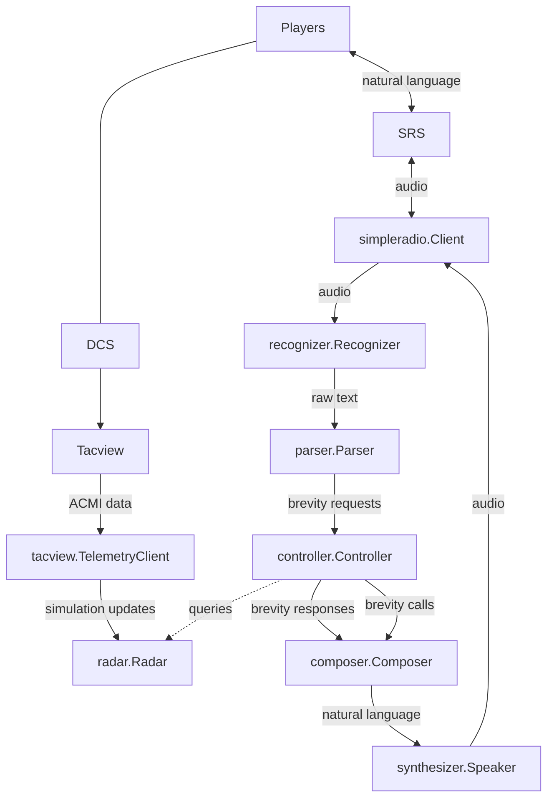

# Knowledge

Requirements to develop SkyEye:

- Windows or Linux PC
  - If on Windows, willing to learn to use Visual Studio Code
  - Does not build on macOS due to [this issue](https://github.com/amitybell/piper/issues/1)
- Beginner level skills in the Go programming language. If you already know another programming language, [A Tour of Go](https://go.dev/tour) can get you up to speed in an afternoon.
- Comfortable with Git
- Familiar with *nix command line basics (not much, mostly `cd` and `make`)
- Familiar with building C/C++ projects is a plus, but not required

# Setup

## Build

### Windows

I apologize upfront for how involved the setup is on Windows. I tried putting it all in Docker but Docker Desktop's latency is terrible and the bot wasn't able to transmit audio consistently. Oh well...

[Install MSYS2](https://www.msys2.org/#installation).

Run the MSYS2 UCRT application from the start menu.

Run `pacman -Syu --needed git base-devel`. If prompted to select a package from a list, accept the defaults. If the application prompts you to restart, restart and run the command again.

Clone this Git repository somewhere, and navigate to it in the MSYS2 UCRT terminal. Your `C:\` is available at `/c`, so you can access your Documents folder with `cd '/c/Documents and Settings/yourusername/Documents/'`. Similarly, your `D:\` will be at `/d` if present, and so on.

Run `make install-msys2-dependencies` to install the C++ and Go compilers as well as some build dependencies.

Run `make` to build `skyeye.exe`.

### Linux

Clone this Git repository somewhere, and navigate to it in your favorite terminal.

Run one of the following to install dependency libraries:

```sh
# Arch Linux
make install-arch-linux-dependencies
# Debian/Ubuntu
make install-debian-dependencies
```

Run `make` to build `skyeye`.

Anyhwere this guide mentions `skyeye.exe`, remove `.exe` - just run `skyeye`.

## Run

Install the [DCS World Dedicated Server](https://www.digitalcombatsimulator.com/en/downloads/world/server/). This can be on a different computer.

Install the [Tacview exporter for DCS](https://www.tacview.net/documentation/dcs/en/) on the same computer as DCS. Enable Real-Time telemetry.

Install [DCS-SRS](http://dcssimpleradio.com/). This can be on a different computer.

Launch the DCS server and SRS server. Load a mission on the DCS server.

You will need to download an OpenAI Whisper model. The main source of these models is [Hugging Face](https://huggingface.co/ggerganov/whisper.cpp/tree/main)]. The larger models have better accuracy but higher memory consumption and take longer to recognize text. There are also faster distilled models available [here](https://huggingface.co/distil-whisper/distil-medium.en#whispercpp), [although these have some quality trade-offs with the library used in this software.](https://github.com/ggerganov/whisper.cpp/tree/master/models#distilled-models). Whichever model you choose, put the model next to `skyeye.exe`.

Run SkyEye by passing command line flags to `skyeye.exe`. You can run `./skyeye.exe -help` for some hints. A simple example:

```sh
./skyeye.exe \
  -telemetry-address=your-tacview-server-ip:42674 \
  -telemetry-password-yourtelemetrypassword \
  -srs-server-address=your-srs-server-ip:5002 \
  -srs-eam-password=yourSRSEAMpassword \
  -whisper-model=ggml-medium.en.bin
```

If all goes well, you should see the SkyEye software start up and start logging JSON lines to the console.

## Develop

### Windows

Install [Visual Studio Code](https://code.visualstudio.com/).

Configure Visual Studio Code for [Go development](https://learn.microsoft.com/en-us/azure/developer/go/configure-visual-studio-code) and [GCC with MinGW](https://code.visualstudio.com/docs/cpp/config-mingw).

For convenience, add MSYS2 to Visual Studio Code's integrated terminal. Open your User `settings.json`, use IntelliSense to complete `terminal.integrated.profiles.windows`, and add this object to the array:

```json
"MSYS2": {
    "path": "C:\\msys64\\usr\\bin\\bash.exe",
    "args": [
        "--login",
        "-i"
    ],
    "env": {
        "MSYSTEM": "MINGW64",
        "CHERE_INVOKING": "1"
    }
}
```

I don't have this project set up to build/run/debug through VSC yet- but it's possible to do interactive debugging so by running `skyeye.exe` through `dlv --headless --listen=:2345 exec skyeye.exe...` and then attaching VSC to a remote debugger on port 2345.

### Linux

🐧 Use your favorite editor.

## Project Layout and Key Files

This project follows [Go standard project layout](https://github.com/golang-standards/project-layout).

- `cmd/skyeye/main.go`: Main application entrypoint.
- `internal`: [Internal packages](https://go.dev/doc/go1.4#internalpackages)
  - `application/app.go`: This is the glue that holds the rest of the system together. Sets up all the pieces of the application, wires them together and starts a bunch of concurrent routines.
  - `conf/configuration.go`: Application configuration values and miscellaneous globals.
- `pkg`: Library packages
  - `brevity`: Models and types related to the structure, syntax and semantics of air combat communication. Defines the messages passed between components during a GCI workflow.
  - `coalitions`: Types that define the BLUE and RED coalitions in DCS. Split out to untangle an import cycle.
  - `composer`: Turns brevity messages from internal data structures to English language text.
  - `controller`: High-level GCI logic. Bridges between brevity messages and the radar package.
  - `encyclopedia`: Database of information about aircraft and air combat.
  - `parser`: Turns brevity from English language text into internal data structures.
  - `pcm`: Utilities for working with [PCM audio](https://en.wikipedia.org/wiki/Pulse-code_modulation).
  - `radar`: Mid-level GCI logic. Converts lower level concepts like trackfiles, Lon/Lat coordinates and individual contacts to higher level concepts like groups and bullseye/BRAA polar coordinates.
  - `recognizer`: Converts audio to text (Speech-To-Text).
  - `sim`: High-level interface for reading data from DCS World.
  - `simpleradio`: Client for transmitting and receiving audio using SimpleRadio-Standalone.
  - `synthesizer`: Converts text to audio (Text-To-Speech).
  - `tacview`: Client for reading data from Tacview's real-time telemetry.
  - `trackfile`: Low-level GCI logic. Converts instantaneous data read from the sim into trackfiles that model aircraft data changing over time.
- `third_party`: Used during the build process to build C++ libraries.
- `Makefile`: Build scripts.
- `tools.go`: Declares tooling dependencies.

## Application Workflow


