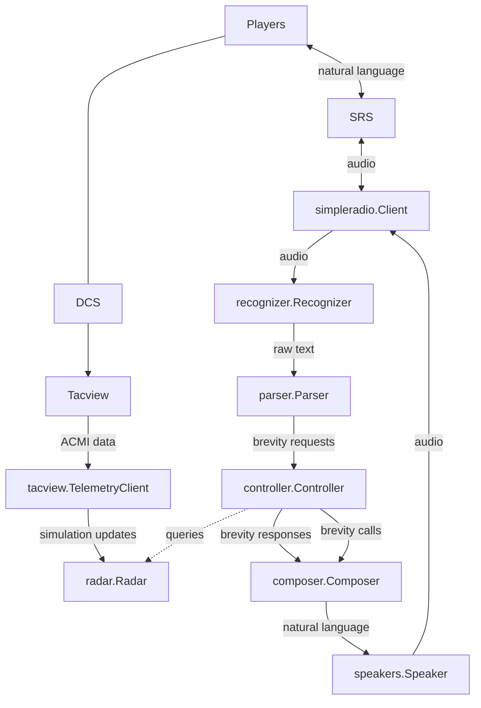

# Knowledge

Requirements to develop SkyEye:

- Windows or Linux PC
  - If on Windows, willing to learn to use Visual Studio Code
  - macOS support is experimental. It is currently not included in regression tests, so the build might be broken.
- Beginner level skills in the Go programming language. If you already know another programming language, [A Tour of Go](https://go.dev/tour) can get you up to speed in an afternoon.
- Comfortable with Git
- Familiar with *nix command line basics (not much, mostly `cd` and `make`)
- Familiar with building C/C++ projects is a plus, but not required

# Setup

## Build

### Windows

I apologize upfront for how involved the setup is on Windows. I tried putting it all in Docker but Docker Desktop's latency is terrible and the bot wasn't able to transmit audio consistently. Oh well...

[Install MSYS2](https://www.msys2.org/#installation).

Run the MSYS2 UCRT application from the start menu.

Run `pacman -Syu --needed git base-devel`. If prompted to select a package from a list, accept the defaults. If the application prompts you to restart, restart and run the command again.

Clone this Git repository somewhere, and navigate to it in the MSYS2 UCRT terminal. Your `C:\` is available at `/c`, so you can access your Documents folder with `cd '/c/Documents and Settings/yourusername/Documents/'`. Similarly, your `D:\` will be at `/d` if present, and so on.

Run `make install-msys2-dependencies` to install the C++ and Go compilers as well as some build dependencies.

Run `make` to build `skyeye.exe`.

### Linux

Clone this Git repository somewhere, and navigate to it in your favorite terminal.

Run one of the following to install dependency libraries:

```sh
# Arch Linux
make install-arch-linux-dependencies
# Debian/Ubuntu
make install-debian-dependencies
```

Run `make` to build `skyeye`.

### macOS (Experimental)

Install [Homebrew](https://brew.sh/).

Clone this Git repository somewhere, and navigate to it in your favorite terminal.

Run the following to install dependency libraries:

```sh
make install-darwin-dependencies
```

Run `make` to build `skyeye`.

_This was tested on a Macbook Pro M3 by a contributor. The maintainer does not currently have any Apple Sillicon hardware for regression testing. Your mileage may vary._

## Run Against a Live Server

Install the [DCS World Dedicated Server](https://www.digitalcombatsimulator.com/en/downloads/world/server/). This can be on a different computer.

Install the [Tacview exporter for DCS](https://www.tacview.net/documentation/dcs/en/) on the same computer as DCS. Enable Real-Time telemetry.

Install [DCS-SRS](http://dcssimpleradio.com/). This can be on a different computer.

Launch the DCS server and SRS server. Load a mission on the DCS server.

You will need to download an OpenAI Whisper model. The main source of these models is [Hugging Face](https://huggingface.co/ggerganov/whisper.cpp/tree/main). The larger models have better accuracy but higher memory consumption and take longer to recognize text. 

Recommended models:

- `ggml-small.en.bin` - Good balance between accuracy and performance on high end hardware, even if you don't speak perfectly clearly.
- `ggml-tiny.en.bin` - Significantly faster, but requires you to speak more clearly.

Whichever model you choose, put the model next to the SkyEye binary.

Run SkyEye from the command line. You can run `./skyeye --help` for an example and a list of available flags. If all goes well, you should see the SkyEye software start up and start logging to the console.

If you get an error, double check the following:

- You are running SkyEye in an MSYS2 UCRT terminal and not a regular Windows terminal/PowerShell/Git Bash.
- You are using a Whisper model compatible with your hardware and this software. I use `ggml-small.en.bin` in my testing.

## Run Using an ACMI File (Experimental)

As an alternative to using a live DCS server, experimental support has been added for loading a `.txt.acmi` or `.acmi.zip` file. Use the `--acmi-file=path/to/file.acmi.zip` flag instead of `--telemetry-address`/`--telemetry-password`.

Currently, SkyEye will read until the end of the file and continue running. To examine a particular moment in time (e.g. for debugging), use the Tacview Client to clip the ACMI file to one that ends at the moment you want to examine. If demand exists I may add a flag to specify a timestamp via the command line.

## Develop

### Editor Settings

The project comes already set up for development with Visual Studio Code, or from the command line using Make. If you prefer another IDE you will need to set the following environment variables in your editor:

```sh
CGO_ENABLED=1
C_INCLUDE_PATH=$(pwd)/third_party/whisper.cpp/
LIBRARY_PATH=$(pwd)/third_party/whisper.cpp/"
```

Where `$(pwd)` is the **absolute path** to the repository directory.

You will also need to set the following build tags:

```
nolibopusfile
```

A contributor got [JetBrains Goland](https://www.jetbrains.com/go/) working by setting the above configuration.

### Windows

Install [Visual Studio Code](https://code.visualstudio.com/).

Configure Visual Studio Code for [Go development](https://learn.microsoft.com/en-us/azure/developer/go/configure-visual-studio-code) and [GCC with MinGW](https://code.visualstudio.com/docs/cpp/config-mingw).

For convenience, add MSYS2 to Visual Studio Code's integrated terminal. Open your User `settings.json`, use IntelliSense to complete `terminal.integrated.profiles.windows`, and add this object to the array:

```json
"MSYS2": {
    "path": "C:\\msys64\\usr\\bin\\bash.exe",
    "args": [
        "--login",
        "-i"
    ],
    "env": {
        "MSYSTEM": "UCRT64",
        "CHERE_INVOKING": "1"
    }
}
```

You can then run all the development commands through the "MSYS2" shell in the new terminal dropdown. Neat!

I don't have this project set up to build/run/debug through VSC yet- but it's possible to do interactive debugging with [Delve](https://github.com/go-delve/delve) by running `skyeye` through `dlv --headless --listen=:2345 exec skyeye...` and then attaching VSC to a remote debugger on port 2345.

### Linux/macOS

🐧 🍎 Use your favorite editor. Build with `make`/`go`. Debug with Delve or your IDE.

If your preferred editor is Visual Studio Code, copy `.vscode/settings-linux.json` to `.vscode/settings.json`.

Wow, that was easy!

## Test

The canonical way to run the unit tests is by running `make test`. This can run tests for code that uses CGO. **This is the gate used for PR checks.**

I have made an effort to structure packages so that CGO is never imported directly or indirectly within packages that aren't directly related to the Speech-To-Text and Text-To-Speech models. This means that most tests can be run though Visual Studio Code without the complexity and performance hit of CGO. **This is the easiest way to test and debug during development.**

## Lint

You can run `make lint` and `make vet` to run some linters to catch some common mistakes, like forgetting to check an error. These also run on every submitted PR as a required check.

## Project Layout and Key Files

This project follows [Go standard project layout](https://github.com/golang-standards/project-layout).

- `cmd/skyeye/main.go`: Main application entrypoint.
- `internal`: [Internal packages](https://go.dev/doc/go1.4#internalpackages)
  - `application/app.go`: This is the glue that holds the rest of the system together. Sets up all the pieces of the application, wires them together and starts a bunch of concurrent routines.
  - `conf/configuration.go`: Application configuration values and miscellaneous globals.
- `pkg`: Library packages
  - `bearings`: Models and functions related to handling true and magnetic compass bearings.
  - `brevity`: Models and types related to the structure, syntax and semantics of air combat communication. Defines the messages passed between components during a GCI workflow.
  - `coalitions`: Types that define the BLUE and RED coalitions in DCS. Split out to untangle an import cycle.
  - `composer`: Turns brevity messages from internal data structures to English language text.
  - `controller`: High-level GCI logic. Bridges between brevity messages and the radar package.
  - `encyclopedia`: Database of information about aircraft and air combat.
  - `parser`: Turns brevity from English language text into internal data structures.
  - `pcm`: Utilities for working with [PCM audio](https://en.wikipedia.org/wiki/Pulse-code_modulation).
  - `radar`: Mid-level GCI logic. Converts lower level concepts like trackfiles, Lon/Lat coordinates and individual contacts to higher level concepts like groups and bullseye/BRAA polar coordinates.
  - `recognizer`: Converts audio to text (Speech-To-Text).
  - `sim`: High-level interface for reading data from DCS World.
  - `simpleradio`: Client for transmitting and receiving audio using SimpleRadio-Standalone.
  - `synthesizer`: Converts text to audio (Text-To-Speech).
  - `tacview`: Client for reading data from Tacview's real-time telemetry.
  - `trackfile`: Low-level GCI logic. Converts instantaneous data read from the sim into trackfiles that model aircraft data changing over time.
- `third_party`: Used during the build process to build C++ libraries.
- `Makefile`: Build scripts.
- `tools.go`: Declares tooling dependencies.

## Application Workflow

