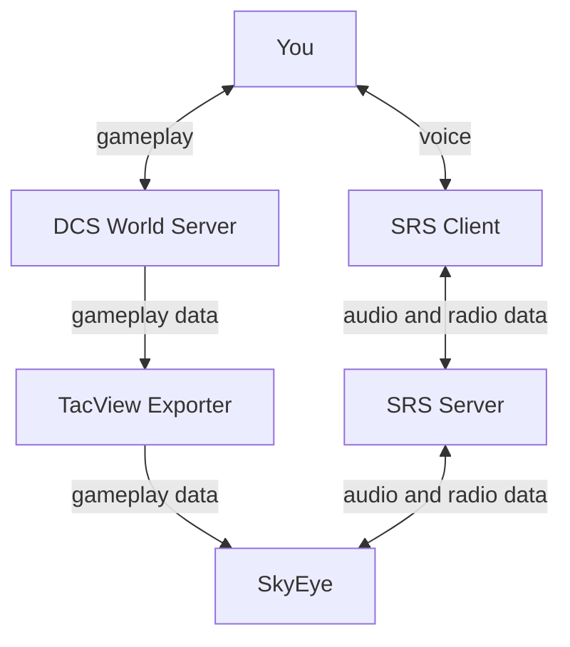
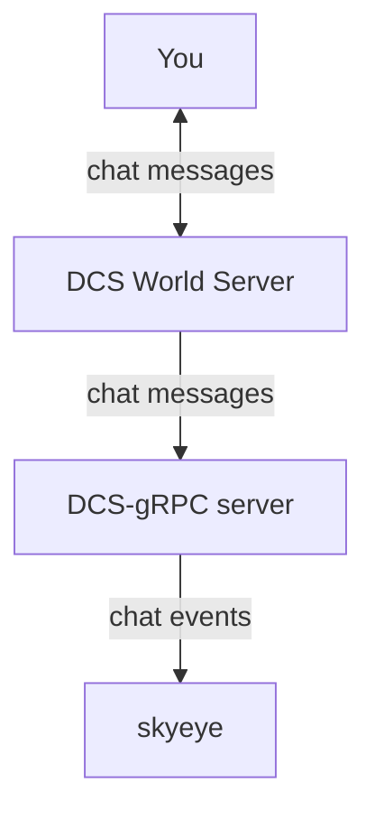
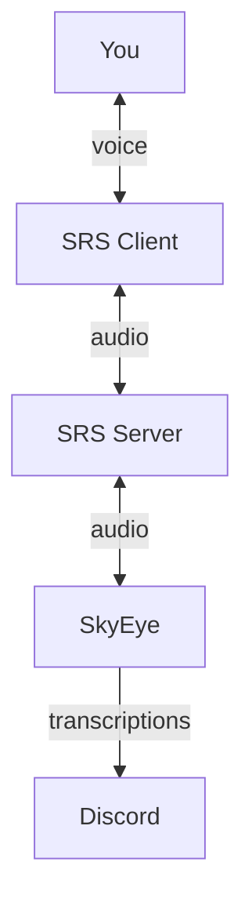

# Privacy

This document describes how player data is used and stored in SkyEye.

## How SkyEye Works

SkyEye works by connecting to TacView Exporter and SimpleRadio-Standalone Server to read gameplay, audio and radio data and transmit audio data.

### Chat Integration

The server administrator can optionally enable SkyEye to directly read in-game chat messages from DCS World. These are used for players who are not able to use their voice to trigger commands.

### Discord Integration

The server administrator can optionally enable SkyEye to publish trace messages to a Discord text channel. These messages include text transcriptions of voice audio, and are useful for players to self-troubleshoot speech recognition problems.

## Your Data in SkyEye

SkyEye connects to the SimpleRadio Standalone server (just like the official SRS-Client software) and a TacView real-time telemetry service (just like the official TacView client software). SkyEye has access to the same information these applications have, including:

- Your name inside both DCS and SRS
- Unencrypted voice audio in SimpleRadio
- Gameplay activity inside DCS and SRS including UnitID, vehicle name, in-game position data and your selected radio channels

> Note: The "encryption" feature inside SRS is **not** an actual encryption system. It does not actually protect your voice audio from being read by other SRS clients.

In order to function, SkyEye temporarily buffers audio data from SRS broadcast on the configured SkyEye frequencies. This audio data is discarded immediately after it is transcripted into text, usually within seconds. It is never saved to disk or to a database.

If the in-game 

SkyEye outputs logs so server operators and developers can troubleshoot and improve SkyEye. The logs may be stored as long as the operator of the SkyEye server chooses to do so. These logs may include:

- Your name inside both DCS and SRS
- Automated transcriptions of voice audio in SimpleRadio on the configured SkyEye frequencies
- Gameplay activity inside DCS and SRS including UnitID, vehicle name, in-game position data and your selected radio channels
- If the in-game chat integration is enabled, in-game chat messages

SkyEye prioritizes speed over accuracy, so **the transcriptions are not accurate and may contain things that were not actually said.** For example, the codeword "Fox" is commonly mis-transcribed as "F**ks". [The speech recognition technology used is infamous for its inaccuracy](https://apnews.com/article/ai-artificial-intelligence-health-business-90020cdf5fa16c79ca2e5b6c4c9bbb14). SkyEye performs a great deal of post-processing of the transcriptions to best-guess at the player's intended selection from a limited set of commands; it is not a general-purpose dictation service. This software is not intended to be an accessibility tool for the hearing-impaired or a moderation tool. 

The server operator may change the content of these logs using the `enable-transcription-logging` option. If this option is disabled, full text transcriptions are not logged. Small tokens of the text may still be logged if they are interpreted as part of a bot command. Transcriptions which do not seem to be directed at the bot will not be logged at all, and the full text of each message be excluded from the logs.

If the Discord integration is enabled, the transcriptions are also sent as messages to a Discord text channel along with some debugging data. The Discord server administrator may choose to make these messages visible to members of the Discord server. Please read the [Discord Terms of Service](https://discord.com/terms), [Discord Privacy Policy](https://discord.com/privacy), and [this article on data retention practices](https://support.discord.com/hc/en-us/articles/5431812448791-How-long-Discord-keeps-your-information) for more information on how Discord handles data.
