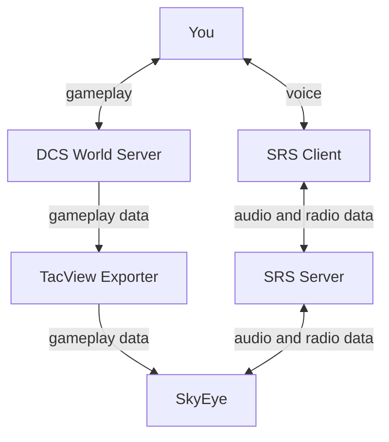

# Privacy

This document describes how player data is used and stored in SkyEye.

## How SkyEye Works

SkyEye works by connecting to TacView Exporter and SimpleRadio-Standalone Server to read gameplay, audio and radio data and transmit audio data.



## Your Data in SkyEye

SkyEye connects to the SimpleRadio Standalone server (just like the official SRS-Client software) and a TacView real-time telemetry service (just like the official TacView client software). SkyEye has access to the same information these applications have, including:

- Your name inside both DCS and SRS
- Unencrypted voice audio in SimpleRadio
- Gameplay activity inside DCS and SRS including UnitID, vehicle name, in-game position data and your selected radio channels

> Note: The "encryption" feature inside SRS is **not** an actual encryption system. It does not actually protect your voice audio from being read by other SRS clients.

In order to function, SkyEye temporarily buffers audio data from SRS broadcast on the configured SkyEye frequency. This audio data is discarded immediately after it is transcripted into text, usually within seconds. It is never saved to disk or to a database.

SkyEye outputs logs so server operators and developers can troubleshoot and improve SkyEye. The logs may be stored as long as the operator of the SkyEye server chooses to do so. These logs may include:

- Your name inside both DCS and SRS
- Automated transcriptions of voice audio in SimpleRadio on the configured SkyEye frequency
- Gameplay activity inside DCS and SRS including UnitID, vehicle name, in-game position data and your selected radio channels

An example of the transcripted audio is provided below:

```
4:21PM INF no wake word found in text callsign=Magic text="is it coming through clearly on 
your end by the way or is it um does it sound fine "
4:21PM INF unable to parse text text="Is it coming through clearly on your end, by the way?\nOr is it, um...\nDoes it sound fine?\n"
4:21PM INF recognizing audio sample received from SRS client byteLength=69760
4:21PM INF recognized audio sample text="Yeah, definitely. It's got me on my side very, very well.\n"
4:21PM INF parsing text text="Yeah, definitely. It's got me on my side very, very well.\n"
4:21PM DBG sanitizing text text="Yeah, definitely. It's got me on my side very, very well.\n"
4:21PM DBG lowercased text text="yeah, definitely. it's got me on my side very, very well.\n"
4:21PM DBG replaced punctuation text="yeah definitely  it s got me on my side very very well "
4:21PM DBG sanitized text text="yeah definitely  it s got me on my side very very well "   
4:21PM INF no wake word found in text callsign=Magic text="yeah definitely  it s got me on 
my side very very well "
4:21PM INF unable to parse text text="Yeah, definitely. It's got me on my side very, very well.\n"
4:21PM INF recognizing audio sample byteLength=68480
4:21PM INF recognized audio text="Okay, good. That's one of the things I was testing today 
is whether it sounds okay in multiplayer.\n"
4:21PM INF parsing text text="Okay, good. That's one of the things I was testing today is whether it sounds okay in multiplayer.\n"
4:21PM DBG sanitizing text text="Okay, good. That's one of the things I was testing today is whether it sounds okay in multiplayer.\n"
4:21PM DBG lowercased text text="okay, good. that's one of the things i was testing today is whether it sounds okay in multiplayer.\n"
4:21PM DBG replaced punctuation text="okay good  that s one of the things i was testing today is whether it sounds okay in multiplayer "
4:21PM DBG sanitized text text="okay good  that s one of the things i was testing today is 
whether it sounds okay in multiplayer "
4:21PM INF no wake word found in text callsign=Magic text="okay good  that s one of the things i was testing today is whether it sounds okay in multiplayer "
4:21PM INF unable to parse text text="Okay, good. That's one of the things I was testing today is whether it sounds okay in multiplayer.\n"
```